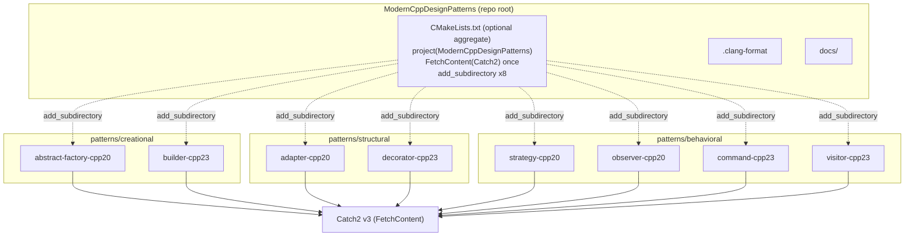
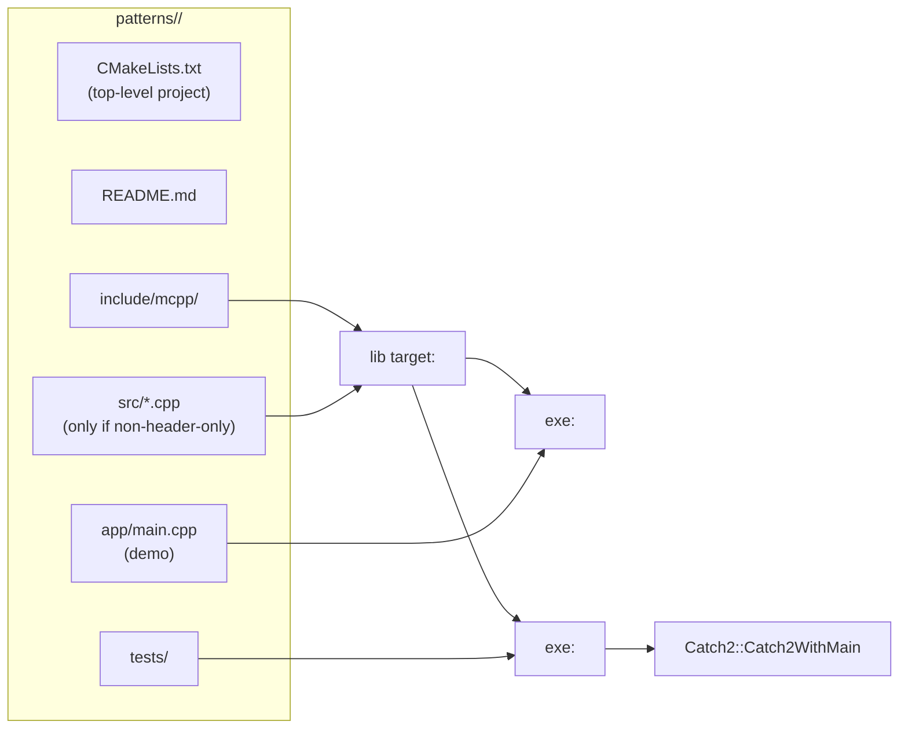

# Design Document Specification — Modern C++ Design Patterns

**Project:** vladiant/ModernCppDesignPatterns
**Document type:** Design Document Specification (portfolio project)
**Status:** Ready for C++ Developer implementation
**Date:** 2026-10-05
**Author:** System Architect
**Designs against:** `docs/requirements/SRS.md` (approved)

---

## 0. How to read this document

This document is prescriptive. The C++ Developer should be able to implement
every one of the 8 standalone pattern projects without making further
structural decisions. Where more than one reasonable option exists, the chosen
option and its trade-off are recorded under **Design Decisions & Trade-offs**
(Section 9) or inline.

Illustrative CMake and pseudo-C++ snippets appear throughout. They are
**contracts to follow**, not final source — the Developer writes the real code.
Interface signatures are normative; bodies shown are sketches.

---

## 1. Open-question resolutions (SRS §6)

These SRS open questions are resolved here with sensible defaults so the
Developer is unblocked. Each is a design decision of record.

| OQ | Question | Resolution (default) | Rationale |
|----|----------|---------------------|-----------|
| OQ-1 | Cross-platform build? | **Linux + g++ 13.3 / clang++ 18 only** this iteration. Code stays portable (no platform APIs), but only Linux is a committed target. | Matches A-3; avoids MSVC-specific `/W4`, `__has_include` churn. Portable code keeps the door open for a later iteration at zero cost. |
| OQ-2 | Test framework? | **Catch2 v3 via `FetchContent`.** Used identically across all 8 projects. | SRS NFR-5 recommendation; minimal boilerplate keeps pattern code front-and-center; `catch_discover_tests` gives clean CTest integration. |
| OQ-3 | Aggregate build / CI now? | **Provide the optional top-level aggregate `CMakeLists.txt` now** (FR-6). **Do not** author CI here — that is the Release Engineer's deliverable; Section 10 documents how CI should drive the aggregate build. | Aggregate build is cheap, enables one-command CI, and does not violate standalone-ness. |
| OQ-4 | Formatting / linting standard? | **Provide a repo-root `.clang-format` (LLVM base, 4-space indent, 100 col).** `clang-tidy` is **optional/non-blocking** this iteration. | Portfolio polish without gating builds. The `.clang-format` is a Developer deliverable; its exact keys are specified in Section 8.4. |
| OQ-5 | May the pattern↔standard mapping change? | **No change.** The SRS table is kept verbatim (4 C++20 / 4 C++23, all categories covered). | The mapping already yields strong, idiomatic demonstrations per pattern (Section 7). No cleaner arrangement found. |

Additional resolution:
- **NFR-3 warnings-as-errors mechanism:** a per-project cache **option
  `PATTERN_WERROR` (default `OFF`)**. CI flips it `ON` (`-DPATTERN_WERROR=ON`).
  Local/day-to-day builds stay friction-free. (The SRS suggested default ON for
  CI; we make the *option default* OFF and have CI opt in — same end state, more
  friendly locally. See Section 9, DD-6.)

---

## 2. Architecture Overview

The repository is a **collection of 8 mutually independent standalone CMake
projects**, grouped by GoF category. There is **no shared runtime library** and
**no cross-project code dependency** — each project is a self-contained unit so
it satisfies FR-1 (buildable in isolation). The only shared *concept* is a
repeated CMake boilerplate pattern (Section 5) and naming conventions
(Section 8), duplicated per project on purpose for standalone clarity.

An **optional aggregate `CMakeLists.txt`** at the repo root adds every project
via `add_subdirectory` purely for convenience and CI. It owns a single
`FetchContent` of Catch2 that all subprojects transparently reuse, so an
aggregate build fetches Catch2 **once**, while a standalone build of any single
project fetches (or finds) Catch2 for itself.



**Dependency direction:** aggregate → subprojects (build-time only, dashed).
Each subproject → Catch2 (test target only). No subproject → subproject edges.

### 2.1 Internal structure of one standalone project



---

## 3. Repository Layout

### 3.1 Naming convention for project directories

`patterns/<category>/<pattern-kebab>-cpp<std>/`

- `<category>` ∈ { `creational`, `structural`, `behavioral` } — encodes GoF
  category (satisfies NFR-6 "category obvious").
- `<pattern-kebab>` — the pattern name in kebab-case.
- `-cpp<std>` — `cpp20` or `cpp23`, so the target standard is visible in the
  path itself (supports FR-5 / self-describing portfolio, FR-7).

### 3.2 Full tree

```
ModernCppDesignPatterns/
├── CMakeLists.txt                      # OPTIONAL aggregate (project(ModernCppDesignPatterns))
├── .clang-format                       # repo-wide style (Section 8.4)
├── .gitignore                          # already present
├── LICENSE                             # MIT, already present
├── docs/
│   ├── requirements/SRS.md             # approved SRS
│   └── design/DESIGN.md                # THIS document (intended home)
└── patterns/
    ├── creational/
    │   ├── abstract-factory-cpp20/
    │   └── builder-cpp23/
    ├── structural/
    │   ├── adapter-cpp20/
    │   └── decorator-cpp23/
    └── behavioral/
        ├── strategy-cpp20/
        ├── observer-cpp20/
        ├── command-cpp23/
        └── visitor-cpp23/
```

### 3.3 Internal layout of **every** standalone project

Using `abstract-factory-cpp20` as the template (identical shape for all 8):

```
abstract-factory-cpp20/
├── CMakeLists.txt                      # valid top-level project() — buildable alone
├── README.md                           # pattern + standard + idiom (FR-7)
├── include/
│   └── mcpp/
│       └── abstract_factory/
│           ├── widgets.hpp             # concepts + product types
│           └── factories.hpp           # factory types + generic client
├── app/
│   └── main.cpp                        # demo (FR-2); defines int main()
└── tests/
    └── abstract_factory_test.cpp       # Catch2 TEST_CASEs (FR-3)
```

Rules:
- **Header-first.** Pattern projects here are small and idiom-centric; keep the
  pattern code in `include/mcpp/<pattern>/*.hpp` as an **INTERFACE** library.
  Add a `src/` with a **STATIC** library **only** if a pattern genuinely needs a
  non-template translation unit (none of the 8 require it — see each pattern in
  Section 7). This keeps demo and tests compiling the same headers with no
  divergence.
- `app/main.cpp` is the **only** file that defines `main()` for the demo.
- Catch2's `Catch2WithMain` provides `main()` for the test executable — tests
  must **not** define their own `main()`.
- Every project's `include/` root is `include/`, with the public header path
  `mcpp/<pattern>/...`, so `#include <mcpp/abstract_factory/factories.hpp>`
  works uniformly.

---

## 4. Test Framework Decision

**Confirmed: Catch2 v3, pinned tag `v3.7.1`, pulled via `FetchContent`.**
Registration with CTest uses **`catch_discover_tests`** (one CTest entry per
`TEST_CASE`, better granularity than a single `add_test`).

Canonical fetch + registration block (identical in every project; see Section 5
for where it sits):

```cmake
# --- Catch2 v3: reuse aggregate's copy if present, else find, else fetch ---
if(NOT TARGET Catch2::Catch2WithMain)
  find_package(Catch2 3 QUIET)
endif()
if(NOT TARGET Catch2::Catch2WithMain)
  include(FetchContent)
  FetchContent_Declare(
    Catch2
    GIT_REPOSITORY https://github.com/catchorg/Catch2.git
    GIT_TAG        v3.7.1
    GIT_SHALLOW    TRUE
  )
  FetchContent_MakeAvailable(Catch2)
endif()

# Make Catch.cmake (provides catch_discover_tests) available in both paths:
if(DEFINED catch2_SOURCE_DIR)                 # FetchContent path
  list(APPEND CMAKE_MODULE_PATH "${catch2_SOURCE_DIR}/extras")
endif()
include(Catch)                                # find_package path installs this module
```

**Single-fetch guarantee (DD-2):** `FetchContent` is keyed by the lowercase
name `catch2`. The aggregate root declares and makes Catch2 available *before*
`add_subdirectory`, so the `Catch2::Catch2WithMain` target already exists when
each subproject runs the block above — the `if(NOT TARGET ...)` guards make the
subproject a no-op reuse. A standalone build of one project has no such target,
so it finds an installed Catch2 or fetches its own. This satisfies "no refetch
per project in the aggregate build" while keeping each project truly standalone.

---

## 5. Per-project CMake Contract

Every `patterns/.../CMakeLists.txt` follows this reusable template. Shown for
`abstract-factory-cpp20` (C++ standard `20`); C++23 projects set `cxx_std_23`
and `CMAKE_CXX_STANDARD 23`. **Only three tokens change per project**: the
`project()` name, the standard number, and the pattern/target basename.

```cmake
cmake_minimum_required(VERSION 3.28)
project(abstract_factory_cpp20 LANGUAGES CXX)

# ---- standard enforcement (NFR-4) ----
set(CMAKE_CXX_STANDARD 20)                 # 23 for C++23 projects
set(CMAKE_CXX_STANDARD_REQUIRED ON)
set(CMAKE_CXX_EXTENSIONS OFF)

# ---- warnings policy (NFR-3) ----
option(PATTERN_WERROR "Treat compiler warnings as errors" OFF)

add_library(pattern_warnings INTERFACE)
target_compile_options(pattern_warnings INTERFACE
  -Wall -Wextra -Wpedantic
  $<$<BOOL:${PATTERN_WERROR}>:-Werror>)

# ---- the pattern code: header-only INTERFACE library ----
add_library(abstract_factory INTERFACE)
target_include_directories(abstract_factory INTERFACE
  "${CMAKE_CURRENT_SOURCE_DIR}/include")
target_compile_features(abstract_factory INTERFACE cxx_std_20)   # cxx_std_23 for C++23

# ---- demo executable (FR-2) ----
add_executable(abstract_factory_demo app/main.cpp)
target_link_libraries(abstract_factory_demo
  PRIVATE abstract_factory pattern_warnings)

# ---- tests (FR-3) : only when testing is on ----
include(CTest)                             # defines BUILD_TESTING (default ON)
if(BUILD_TESTING)
  # <Catch2 fetch + Catch module block from Section 4 goes here>

  add_executable(abstract_factory_tests tests/abstract_factory_test.cpp)
  target_link_libraries(abstract_factory_tests
    PRIVATE abstract_factory pattern_warnings Catch2::Catch2WithMain)

  catch_discover_tests(abstract_factory_tests)
endif()
```

Contract rules (apply to all 8):
- `project(<pattern>_cpp<std> LANGUAGES CXX)` — underscores in the CMake project
  name (CMake-friendly), kebab-case only in the *directory* name.
- Target names: library `<pattern>`, demo `<pattern>_demo`, tests
  `<pattern>_tests`. (e.g. `builder`, `builder_demo`, `builder_tests`.)
- `pattern_warnings` is an **INTERFACE** carrier for the warning flags; link it
  `PRIVATE` into demo + tests (never into the public INTERFACE lib, so a
  consumer isn't forced into our warning flags — though there are no external
  consumers, this is correct hygiene).
- `include(CTest)` (not bare `enable_testing()`) so `BUILD_TESTING` exists and
  CI can pass `-DBUILD_TESTING=OFF` to skip Catch2 entirely for a demo-only
  build.
- Do **not** hard-set `CMAKE_BUILD_TYPE`; let the invoker choose. CI uses
  `-DCMAKE_BUILD_TYPE=RelWithDebInfo` (Section 10).

### 5.1 Aggregate root `CMakeLists.txt` (optional, FR-6)

```cmake
cmake_minimum_required(VERSION 3.28)
project(ModernCppDesignPatterns LANGUAGES CXX)

include(CTest)                             # enable_testing for the whole tree

# Fetch Catch2 ONCE here; subprojects reuse the resulting target (Section 4).
if(BUILD_TESTING)
  include(FetchContent)
  FetchContent_Declare(
    Catch2
    GIT_REPOSITORY https://github.com/catchorg/Catch2.git
    GIT_TAG        v3.7.1
    GIT_SHALLOW    TRUE
  )
  FetchContent_MakeAvailable(Catch2)
  list(APPEND CMAKE_MODULE_PATH "${catch2_SOURCE_DIR}/extras")
endif()

add_subdirectory(patterns/creational/abstract-factory-cpp20)
add_subdirectory(patterns/creational/builder-cpp23)
add_subdirectory(patterns/structural/adapter-cpp20)
add_subdirectory(patterns/structural/decorator-cpp23)
add_subdirectory(patterns/behavioral/strategy-cpp20)
add_subdirectory(patterns/behavioral/observer-cpp20)
add_subdirectory(patterns/behavioral/command-cpp23)
add_subdirectory(patterns/behavioral/visitor-cpp23)
```

Note: mixing C++20 and C++23 subprojects in one tree is fine because each
subproject sets its standard via `target_compile_features`/`CMAKE_CXX_STANDARD`
in **its own** scope. The aggregate does not set a global `CMAKE_CXX_STANDARD`.

---

## 6. Common C++ Design Contracts (apply to all patterns)

- **Error handling.** Prefer `std::expected<T, E>` for *recoverable, expected*
  failures that are part of a pattern's contract (Builder validation, Command
  execute/undo). Use exceptions only for *programmer errors*/truly exceptional
  cases. No error codes via out-params. (DD-4.)
- **Ownership.** Default to **value semantics**. Use `std::unique_ptr` for
  polymorphic/owning tree nodes or command history. Use `std::shared_ptr` only
  where shared ownership is genuinely required (none of the 8 need it; Observer
  uses non-owning handles / `std::function`, see Section 7). **No raw owning
  pointers.** Raw pointers/references only for non-owning observation, and must
  not outlive the pointee.
- **Output.** Use `std::format` + `std::cout`/`std::ostream`. **Never**
  `std::print`/`std::println`, `std::generator`, `std::mdspan`, `std::flat_map`
  (libstdc++ 13 gap, A-1 / AC-6).
- **`const`-correctness & `[[nodiscard]]`.** Mark pure query methods `const`;
  mark `build()`, `execute()`, strategy results, and any `std::expected`-
  returning function `[[nodiscard]]`.
- **Namespaces.** Root `mcpp`; each pattern in `mcpp::<pattern>` (Section 8.1).

---

## 7. Per-pattern Low-level Design

Each subsection gives: domain, key types/interfaces, how the named modern idiom
is applied concretely, what the demo must show (FR-2), and what tests must
assert (FR-3). Signatures are normative; bodies are sketches.

---

### 7.1 Abstract Factory — Creational — **C++20**
*Idioms: `concepts` constraining product families; `std::format`.*

**Domain:** a UI theme toolkit. Two product families — **Light** and **Dark**
themes — each producing a `Button` and a `Checkbox`. A generic client renders a
dialog using whichever family it is given, with the family enforced by concepts
(value semantics, **no virtual inheritance** — the modern twist is that the
"abstract" contract is a *concept*, not a base class).

**Key types (`include/mcpp/abstract_factory/`):**

```cpp
namespace mcpp::abstract_factory {

// Product concepts — the "abstract products".
template <class T>
concept Button = requires(const T& b) {
    { b.render() } -> std::convertible_to<std::string>;
};

template <class T>
concept Checkbox = requires(const T& c) {
    { c.render() } -> std::convertible_to<std::string>;
};

// Abstract-factory concept — a family must make a Button and a Checkbox.
template <class F>
concept WidgetFactory = requires(const F& f) {
    { f.make_button()   };
    { f.make_checkbox() };
} && Button<decltype(std::declval<const F&>().make_button())>
  && Checkbox<decltype(std::declval<const F&>().make_checkbox())>;

// Concrete products (value types), e.g.:
struct LightButton   { std::string render() const; };   // std::format("[ {} ]", ...)
struct LightCheckbox { bool checked{}; std::string render() const; };
struct DarkButton    { std::string render() const; };
struct DarkCheckbox  { bool checked{}; std::string render() const; };

struct LightTheme { LightButton make_button() const; LightCheckbox make_checkbox() const; };
struct DarkTheme  { DarkButton  make_button() const; DarkCheckbox  make_checkbox() const; };

// Generic client constrained on the abstract-factory concept.
template <WidgetFactory F>
std::string render_dialog(const F& factory);   // uses std::format to lay out button+checkbox
}
```

**Idiom checkpoints a reviewer can see:** the three `concept` definitions;
`render_dialog` constrained by `WidgetFactory`; `std::format` inside `render()`
and `render_dialog`.

**Demo:** render a dialog with `LightTheme`, then `DarkTheme`; print both. Show
that a wrong-family mix is impossible (one commented static_assert or a note
that `render_dialog(int{})` fails to compile).

**Tests:** `render_dialog(LightTheme{})` and `render_dialog(DarkTheme{})`
produce the expected formatted strings; `static_assert(WidgetFactory<LightTheme>)`
and `static_assert(!WidgetFactory<int>)` hold; individual products' `render()`
output is correct.

---

### 7.2 Builder — Creational — **C++23**
*Idioms: deducing this (explicit object parameter) fluent interface;
`std::expected<T, Error>` validated `build()`.*

**Domain:** build an immutable `HttpRequest` (method, url, headers, body). The
fluent setters use **deducing this** so chaining preserves the caller's value
category (chaining on an rvalue returns rvalues → enables move-out; chaining on
an lvalue returns lvalue refs). `build()` validates and returns
`std::expected`.

**Key types (`include/mcpp/builder/`):**

```cpp
namespace mcpp::builder {

enum class BuildError { missing_url, invalid_method, empty_header_name };

struct HttpRequest {
    std::string method;
    std::string url;
    std::vector<std::pair<std::string, std::string>> headers;
    std::string body;
};

class RequestBuilder {
public:
    // Deducing this: Self&& is the builder's own ref category.
    template <class Self>
    auto&& method(this Self&& self, std::string m) {
        self.method_ = std::move(m);
        return std::forward<Self>(self);
    }
    template <class Self>
    auto&& url(this Self&& self, std::string u) {
        self.url_ = std::move(u);
        return std::forward<Self>(self);
    }
    template <class Self>
    auto&& header(this Self&& self, std::string name, std::string value) {
        self.headers_.emplace_back(std::move(name), std::move(value));
        return std::forward<Self>(self);
    }
    template <class Self>
    auto&& body(this Self&& self, std::string b) {
        self.body_ = std::move(b);
        return std::forward<Self>(self);
    }

    // Validated terminal op. [[nodiscard]]; returns value or error.
    [[nodiscard]] std::expected<HttpRequest, BuildError> build(this const RequestBuilder& self);
    // (Optionally an rvalue overload `build(this RequestBuilder&& self)` that moves fields out.)

private:
    std::string method_{"GET"};
    std::string url_;
    std::vector<std::pair<std::string, std::string>> headers_;
    std::string body_;
};
}
```

`build()` rules: empty `url_` → `std::unexpected(BuildError::missing_url)`;
method not in a small allowed set → `invalid_method`; any header with empty name
→ `empty_header_name`; otherwise the assembled `HttpRequest`.

**Idiom checkpoints:** every setter signature `(this Self&& self, ...)` with
`std::forward<Self>`; `build()` returns `std::expected<HttpRequest, BuildError>`
with `std::unexpected` on each failure path.

**Demo:** build a valid request via a fluent chain and print it (`std::format`);
build an invalid one (missing url) and print the `BuildError` branch; show an
rvalue chain (`RequestBuilder{}.method("POST").url("...").build()`).

**Tests:** valid chain → `expected.has_value()` with correct fields; missing url
→ `expected.error() == BuildError::missing_url`; bad method → `invalid_method`;
rvalue-chained temporary builds successfully (proves deducing-this ref-category
preservation compiles and works).

---

### 7.3 Adapter — Structural — **C++20**
*Idioms: `concepts` + `std::ranges`/views to adapt an incompatible interface.*

**Domain:** a **legacy sensor** with an index-based, Fahrenheit, non-range API
is adapted to a modern **`std::ranges` view of Celsius readings** that composes
with standard range adaptors.

**Key types (`include/mcpp/adapter/`):**

```cpp
namespace mcpp::adapter {

// Adaptee: incompatible legacy interface (no begin/end, Fahrenheit, by index).
class LegacySensor {
public:
    std::size_t count() const;
    double fahrenheit_at(std::size_t i) const;   // throws std::out_of_range if i>=count()
};

// Concept describing the shape the adapter can wrap (so the adapter is reusable).
template <class S>
concept IndexedFahrenheitSource = requires(const S& s, std::size_t i) {
    { s.count() }            -> std::convertible_to<std::size_t>;
    { s.fahrenheit_at(i) }   -> std::convertible_to<double>;
};

// Adapter: exposes a lazy ranges view of Celsius values.
template <IndexedFahrenheitSource S>
class CelsiusView {
public:
    explicit CelsiusView(const S& src);
    // Returns a view: iota(0..count) | transform(index -> celsius).
    auto celsius() const;   // std::ranges::view of double
};
}
```

`celsius()` returns, e.g.,
`std::views::iota(std::size_t{0}, src_.count()) | std::views::transform(to_celsius)`
where `to_celsius(i) = (src_.fahrenheit_at(i) - 32.0) * 5.0 / 9.0`.

**Idiom checkpoints:** the `IndexedFahrenheitSource` concept; the adapter body
composing `std::views::iota`/`std::views::transform`; demo piping the adapted
view through further adaptors (`std::views::filter`, `std::views::take`).

**Demo:** wrap a `LegacySensor`, then write an idiomatic pipeline, e.g.
`adapter.celsius() | std::views::filter(above_freezing) | std::views::take(3)`,
and `std::format`-print the results — showing the legacy API now flows through
standard ranges.

**Tests:** adapted Celsius values match expected conversions; the view composes
with `filter`/`take` and yields the right subset; the view is lazy (iterating
twice re-reads the source — assert values, not a snapshot).

---

### 7.4 Decorator — Structural — **C++23**
*Idioms: deducing this for recursive, type-preserving composition;
`static operator()` for stateless decorator layers.*

**Domain:** a **text-rendering pipeline**. A base source produces text; each
**layer** transforms `std::string -> std::string`. Stateless layers (e.g.
`Uppercase`, `Trim`) are implemented with **`static operator()`** (no per-object
state). A `Decorated` composition type uses **deducing this** so composing
layers builds a new, fully-typed composite (no type erasure, no `std::function`
in the hot path).

**Key types (`include/mcpp/decorator/`):**

```cpp
namespace mcpp::decorator {

// A layer is any invocable string(string).
template <class L>
concept Layer = std::invocable<L, std::string> &&
    std::convertible_to<std::invoke_result_t<L, std::string>, std::string>;

// Stateless layers: static operator() (C++23).
struct Uppercase { static std::string operator()(std::string s); };
struct Trim      { static std::string operator()(std::string s); };

// Stateful layer example: holds data, non-static operator().
struct Prefix { std::string tag; std::string operator()(std::string s) const; };

// Type-preserving composition via deducing this.
template <class Inner, Layer L>
class Decorated {
public:
    Decorated(Inner inner, L layer);

    // Apply inner first, then this layer. Deducing this lets .with(...) chain
    // while preserving/forwarding the composite's value category.
    std::string operator()(this const Decorated& self, std::string in);

    template <class Self, Layer Next>
    auto with(this Self&& self, Next next) {        // returns Decorated<Self-decayed, Next>
        return Decorated<std::remove_cvref_t<Self>, Next>{std::forward<Self>(self), next};
    }
private:
    Inner inner_;
    L     layer_;
};

// Seed a pipeline from a source callable (string()-like) or a plain string.
template <class Source>
auto decorate(Source src);   // returns a Decorated wrapping src with an identity base
}
```

**Idiom checkpoints:** `static std::string operator()(std::string)` on
`Uppercase`/`Trim`; `operator()(this const Decorated& self, ...)` and
`with(this Self&& self, ...)` using deducing this; the composite type grows at
compile time (`Decorated<Decorated<...>, Next>`).

**Demo:** build `decorate(base).with(Trim{}).with(Uppercase{}).with(Prefix{"[LOG] "})`
and print the result for a sample input, demonstrating ordered application and
that the composite is a concrete type (print `typeid`/a comment, or just the
output).

**Tests:** each stateless layer transforms correctly in isolation
(`Uppercase{}("abc") == "ABC"`); a composed pipeline applies layers in the
documented order; `static_assert(Layer<Uppercase>)` and
`static_assert(Layer<Prefix>)`; composition of three layers equals the manual
nested application.

---

### 7.5 Strategy — Behavioral — **C++20**
*Idioms: `std::invocable`/concepts; `std::span` over input; compile-time
strategy selection.*

**Domain:** a numeric **reducer** over `std::span<const double>` with pluggable
strategies (Sum, Mean, Max). The strategy is a concept-constrained callable;
selection can be **compile-time** (template parameter) so there is no virtual
dispatch.

**Key types (`include/mcpp/strategy/`):**

```cpp
namespace mcpp::strategy {

// A strategy reduces a span of doubles to a double.
template <class S>
concept ReduceStrategy =
    std::invocable<S, std::span<const double>> &&
    std::convertible_to<std::invoke_result_t<S, std::span<const double>>, double>;

// Strategies (C++20 → regular operator()).
struct Sum  { double operator()(std::span<const double> xs) const; };
struct Mean { double operator()(std::span<const double> xs) const; }; // 0.0 on empty
struct Max  { double operator()(std::span<const double> xs) const; }; // throws/empty policy: see note

// Context: compile-time strategy selection.
template <ReduceStrategy S>
double reduce(std::span<const double> data, S strategy = S{});
}
```

Empty-span policy (document in README + tests): `Sum` → 0.0; `Mean` → 0.0;
`Max` on empty **throws `std::invalid_argument`** (programmer-error style,
consistent with Section 6, so the return type stays a plain `double`). State
this clearly.

**Idiom checkpoints:** the `ReduceStrategy` concept built on `std::invocable`;
all inputs taken as `std::span<const double>`; `reduce(data, Sum{})` with
compile-time strategy type selection.

**Demo:** define a `std::vector<double>`, call `reduce(span, Sum{})`,
`reduce(span, Mean{})`, `reduce(span, Max{})`; also show passing a **lambda**
strategy (proving the concept accepts any invocable); `std::format`-print.

**Tests:** each strategy returns the correct value for a known dataset; a lambda
strategy satisfies `ReduceStrategy` and works; empty-span policy holds
(`Sum`/`Mean` → 0.0, `Max` throws); `static_assert(ReduceStrategy<Sum>)` and
`static_assert(!ReduceStrategy<int>)`.

---

### 7.6 Observer — Behavioral — **C++20**
*Idioms: `operator<=>` for subscriber ordering/dedup; `std::ranges` for
dispatch; `std::format`.*

**Domain:** a `Subject` broadcasting `Event`s to `Observer`s. Observers carry a
`priority` and `name`; the **`operator<=>`** on the observer handle orders
dispatch (lower priority value first, then name) and enables **dedup** (equal
handles are the same subscriber). Dispatch iterates with `std::ranges`.

**Key types (`include/mcpp/observer/`):**

```cpp
namespace mcpp::observer {

struct Event { std::string topic; std::string payload; };

class Observer {
public:
    Observer(int priority, std::string name, std::function<void(const Event&)> on_event);

    // Three-way comparison drives ordering AND dedup. Compare by (priority, name);
    // the callback is intentionally excluded from identity.
    std::strong_ordering operator<=>(const Observer& rhs) const;
    bool operator==(const Observer& rhs) const;   // in terms of (priority, name)

    int         priority() const;
    const std::string& name() const;
    void        notify(const Event& e) const;     // invokes callback
private:
    int priority_;
    std::string name_;
    std::function<void(const Event&)> on_event_;
};

class Subject {
public:
    bool subscribe(Observer obs);       // false if an equal observer already present (dedup)
    bool unsubscribe(const Observer& obs);
    void publish(const Event& e) const; // dispatch in <=> order via std::ranges
private:
    std::vector<Observer> observers_;   // kept sorted by operator<=>
};
}
```

Implementation guidance: keep `observers_` sorted on insert (binary search via
`std::ranges::lower_bound`); `subscribe` rejects a duplicate (equal under
`<=>`); `publish` does `std::ranges::for_each(observers_, [&](auto& o){ o.notify(e); })`
over the already-sorted vector. Ownership: `Subject` owns `Observer` values;
callbacks are `std::function` (non-owning of any external state the user
captures — document lifetime expectation).

**Idiom checkpoints:** `std::strong_ordering operator<=>` on `Observer`; sorted
dispatch and `std::ranges` algorithms in `Subject`; `std::format` in demo/event
rendering.

**Demo:** subscribe observers out of priority order with distinct names; publish
an event and show they fire in `<=>` order; attempt a duplicate subscribe and
show it is rejected (dedup); unsubscribe one and re-publish.

**Tests:** dispatch order equals the `<=>` order regardless of insertion order;
duplicate subscribe returns `false` and does not double-register; `<=>`
tie-break by name works; an unsubscribed observer no longer receives events.

---

### 7.7 Command — Behavioral — **C++23**
*Idioms: `std::expected` for `execute()`/`undo()`; `static operator()` for
stateless commands; `if consteval` for compile-time-validated commands.*

**Domain:** an integer **accumulator** (a tiny calculator) with an undoable
command stack. Commands mutate the accumulator and report success/failure via
`std::expected`. A stateless command uses **`static operator()`**. A
`constexpr` division helper uses **`if consteval`** to make a divide-by-zero a
*hard compile error* when the operands are known at compile time, but a
*runtime `std::expected` error* otherwise.

**Key types (`include/mcpp/command/`):**

```cpp
namespace mcpp::command {

enum class CommandError { divide_by_zero, nothing_to_undo, overflow };

struct Accumulator { long long value{0}; };

// constexpr helper showcasing if consteval.
constexpr std::expected<long long, CommandError>
safe_div(long long a, long long b) {
    if (b == 0) {
        if consteval {
            // Compile-time call with b==0 → make it ill-formed (not a constant expr).
            throw "divide by zero in constant evaluation";
        } else {
            return std::unexpected(CommandError::divide_by_zero);
        }
    }
    return a / b;
}

// Command contract (concept): execute/undo return std::expected<void, CommandError>.
template <class C>
concept Command = requires(C c, Accumulator& acc) {
    { c.execute(acc) } -> std::same_as<std::expected<void, CommandError>>;
    { c.undo(acc)    } -> std::same_as<std::expected<void, CommandError>>;
};

// Stateful command (holds operand).
struct AddCommand { long long operand;
    std::expected<void, CommandError> execute(Accumulator&) const;
    std::expected<void, CommandError> undo(Accumulator&) const; };

struct DivideCommand { long long divisor; long long previous{};   // previous for undo
    std::expected<void, CommandError> execute(Accumulator&);
    std::expected<void, CommandError> undo(Accumulator&) const; };

// Stateless command via static operator() — e.g. Negate (no operands/state).
struct Negate {
    static std::expected<void, CommandError> operator()(Accumulator& acc);  // acc.value = -acc.value
};

// Invoker: owns a history of applied commands and supports undo.
class CommandStack {
public:
    std::expected<void, CommandError> run(
        std::function<std::expected<void,CommandError>(Accumulator&)> cmd,
        std::function<std::expected<void,CommandError>(Accumulator&)> undo,
        Accumulator& acc);
    std::expected<void, CommandError> undo(Accumulator& acc); // nothing_to_undo if empty
private:
    std::vector<std::function<std::expected<void,CommandError>(Accumulator&)>> undo_stack_;
};
}
```

Note on the invoker: type-erasing commands into `std::function` pairs keeps
`CommandStack` non-templated and testable. (A fully static alternative with a
`std::variant` of command types is possible but heavier; DD-7 picks the
`std::function` history for clarity since this is a behavioral demo, not a
perf exercise.)

**Idiom checkpoints:** `std::expected<void, CommandError>` on every
`execute`/`undo`; `static std::expected<...> operator()` on `Negate`;
`if consteval` inside `safe_div`, used by `DivideCommand::execute`.

**Demo:** run a sequence (Add 5, Negate, Divide by 0 → show the
`std::expected` error branch, Add 2), printing each result; then `undo()` twice
and show the accumulator rewinds. Include a `static_assert(safe_div(10,2) == 5)`
and a commented line showing `safe_div(1,0)` fails to compile at constant-eval
(demonstrating `if consteval`).

**Tests:** successful commands update `Accumulator` and return a value;
`DivideCommand{0}.execute` returns `std::unexpected(divide_by_zero)` at runtime;
`undo` on empty stack returns `nothing_to_undo`; undo correctly reverses Add and
Divide; `Negate{}(acc)` (stateless static-call) negates; a `constexpr`/
`static_assert` test pins `safe_div` constant-eval behavior.

---

### 7.8 Visitor — Behavioral — **C++23**
*Idioms: `std::variant` + an `overloaded` visitor; recursion via deducing this.*

**Domain:** a small arithmetic **expression tree** modeled as a recursive
`std::variant` (`Number`, `Add`, `Mul`, `Neg`). Two operations — `evaluate` and
`to_string` — are implemented by visiting the variant with the classic
`overloaded` helper. **Recursion** over child nodes is done with a **deducing
this** lambda that calls itself without `std::function` or a named recursive
free function.

**Key types (`include/mcpp/visitor/`):**

```cpp
namespace mcpp::visitor {

struct Expr;                              // forward decl (recursive)
using ExprPtr = std::unique_ptr<Expr>;    // owning child edges

struct Number { double value; };
struct Add    { ExprPtr lhs; ExprPtr rhs; };
struct Mul    { ExprPtr lhs; ExprPtr rhs; };
struct Neg    { ExprPtr operand; };

struct Expr { std::variant<Number, Add, Mul, Neg> node; };

// Classic overloaded helper (aggregate + CTAD + using-declarations).
template <class... Ts> struct overloaded : Ts... { using Ts::operator()...; };
// (CTAD guide implicit in C++20+; add an explicit one if the chosen compiler needs it.)

// Factory helpers (value semantics in, unique_ptr out).
ExprPtr number(double v);
ExprPtr add(ExprPtr a, ExprPtr b);
ExprPtr mul(ExprPtr a, ExprPtr b);
ExprPtr neg(ExprPtr a);

double      evaluate(const Expr& e);     // see deducing-this recursion below
std::string to_string(const Expr& e);    // std::format-based pretty printer, same recursion
}
```

The deducing-this recursion pattern (the headline idiom) looks like:

```cpp
auto eval = [](this auto const& self, const Expr& e) -> double {
    return std::visit(overloaded{
        [](const Number& n) { return n.value; },
        [&](const Add& a)   { return self(*a.lhs) + self(*a.rhs); },
        [&](const Mul& m)   { return self(*m.lhs) * self(*m.rhs); },
        [&](const Neg& g)   { return -self(*g.operand); },
    }, e.node);
};
```

**Idiom checkpoints:** the `std::variant`-based `Expr`; the `overloaded`
helper with `using Ts::operator()...`; the `[](this auto const& self, ...)`
self-recursive lambda (deducing this) used by both `evaluate` and `to_string`.

**Demo:** build e.g. `add(mul(number(3), number(4)), neg(number(5)))`, print
`to_string` (expect something like `((3 * 4) + (-5))`) and `evaluate` (expect
`7`). Ownership is `unique_ptr`-based; moving the tree into the factories shows
RAII.

**Tests:** `evaluate` returns the right numbers for several trees (including
nesting and `Neg`); `to_string` matches the documented format; deeply nested
tree evaluates correctly; moving an `ExprPtr` into a factory transfers ownership
(no leaks — tested indirectly by correct results / optional ASan in CI).

---

## 8. Naming Conventions & C++ Style

### 8.1 Namespaces
- Root namespace: **`mcpp`** (Modern C++ Patterns).
- Per pattern: **`mcpp::<pattern>`** in `snake_case`:
  `mcpp::abstract_factory`, `mcpp::builder`, `mcpp::adapter`,
  `mcpp::decorator`, `mcpp::strategy`, `mcpp::observer`, `mcpp::command`,
  `mcpp::visitor`.
- No `using namespace` in headers. In `.cpp`/demo/tests, `using namespace
  mcpp::<pattern>;` at function/file scope is acceptable for brevity.

### 8.2 File naming
- Headers: `snake_case.hpp` under `include/mcpp/<pattern>/`.
- Sources (if any): `snake_case.cpp` under `src/`.
- Demo entry: `app/main.cpp`.
- Tests: `tests/<pattern>_test.cpp` (one file per project is enough; split only
  if it grows).

### 8.3 Identifiers
- Types / concepts: `PascalCase` (`RequestBuilder`, `WidgetFactory`,
  `ReduceStrategy`).
- Functions / methods / variables: `snake_case` (`make_button`, `render_dialog`).
- Private data members: trailing underscore (`url_`, `observers_`).
- Enums: `enum class PascalCase { snake_case_values }`.
- Prefer `constexpr`/`inline` constants over macros; avoid macros entirely.

### 8.4 `.clang-format` (repo root)
LLVM base with these overrides (Developer creates the file):
```yaml
BasedOnStyle: LLVM
IndentWidth: 4
ColumnLimit: 100
PointerAlignment: Left
AllowShortFunctionsOnASingleLine: Inline
```

### 8.5 RAII / ownership expectations
- Prefer value types and stack allocation.
- Owning polymorphic/tree edges → `std::unique_ptr` (Visitor `ExprPtr`;
  Command history entries are value `std::function`s).
- No `new`/`delete` in user code; use `std::make_unique`.
- Non-owning references (`const T&`, `std::span`, raw `T*` for observation) must
  not outlive their referent; document lifetime at the API boundary.
- `[[nodiscard]]` on all `std::expected`-returning and query functions.

---

## 9. Design Decisions & Trade-offs

| # | Decision | Alternatives considered | Why chosen |
|---|----------|------------------------|-----------|
| DD-1 | **8 independent standalone projects, no shared library.** | A shared `common` utility lib. | FR-1 demands isolation; a shared lib would couple projects and break "build any one alone". Minor CMake boilerplate duplication is accepted for standalone clarity. |
| DD-2 | **Catch2 fetched once at aggregate root; subprojects reuse via `if(NOT TARGET ...)`.** | (a) Each subproject always fetches (slow aggregate build, N clones). (b) Require a system-installed Catch2 (violates NFR-7/NFR-8). | Single clone in aggregate CI, yet standalone builds still self-provision. Keyed-by-name FetchContent makes reuse automatic. |
| DD-3 | **Header-first INTERFACE libraries; `src/` only if needed (none need it).** | Always-STATIC lib with split .hpp/.cpp. | The patterns are template/concept-heavy and small; header-only keeps demo and tests compiling identical code and reduces CMake surface. |
| DD-4 | **`std::expected` for recoverable contract failures; exceptions for programmer errors.** | Exceptions everywhere; error codes via out-params. | Matches SRS idiom goals (Builder/Command explicitly want `std::expected`); clearer, `[[nodiscard]]`-friendly. |
| DD-5 | **`catch_discover_tests` for CTest registration.** | Single `add_test(NAME ... COMMAND <tests>)`. | Per-`TEST_CASE` granularity; better CI reporting; standard Catch2 practice. |
| DD-6 | **`PATTERN_WERROR` cache option, default `OFF`; CI sets `ON`.** | Always `-Werror`; env-var toggle. | Friendly local builds, strict CI (AC-7). A named CMake option is discoverable and per-project. |
| DD-7 | **Command invoker uses `std::function` undo history (type erasure).** | `std::variant` of all command types; fully static. | Keeps `CommandStack` non-templated and trivially unit-testable; perf is a non-goal (SRS §7). |
| DD-8 | **Directory names encode `-cpp20`/`-cpp23`.** | Standard only in README/CMake. | Self-describing portfolio (FR-7/AC-4); reviewer sees the standard in the path. |
| DD-9 | **Observer stores sorted `std::vector<Observer>` with `<=>`-driven dedup.** | `std::set<Observer>` keyed by `<=>`. | A sorted vector showcases `<=>` + `std::ranges` algorithms explicitly (the idiom to demonstrate) and is cache-friendly; `std::set` would hide the comparison behind the container. |
| DD-10 | **Linux-only commitment, portable code.** | Commit to MSVC/macOS now. | SRS A-3/OQ-1; avoids widening NFR-1 scope mid-iteration while keeping future portability free. |

---

## 10. CI-friendliness Notes (for the Release Engineer — informational only)

Do **not** treat this as the CI deliverable; it documents how the design
supports CI so the Release Engineer can author the pipeline.

- **One-command aggregate build & test** (both compilers, strict warnings):
  ```bash
  cmake -S . -B build -G Ninja \
        -DCMAKE_CXX_COMPILER=g++-13 \
        -DPATTERN_WERROR=ON \
        -DCMAKE_BUILD_TYPE=RelWithDebInfo
  cmake --build build
  ctest --test-dir build --output-on-failure
  ```
  Repeat with `-DCMAKE_CXX_COMPILER=clang++-18` in a separate build dir.
- **Standalone verification** (proves FR-1 / AC-1): the pipeline should also
  configure+build **at least one** project from its own directory, e.g.
  `cmake -S patterns/behavioral/visitor-cpp23 -B /tmp/vis && cmake --build /tmp/vis && ctest --test-dir /tmp/vis`.
  A matrix over all 8 standalone builds is ideal.
- **Catch2 is fetched once** per aggregate configure (DD-2); CI can cache the
  `_deps/` or the Git clone to speed reruns.
- **Demo exit codes** (AC-2): CI may run each `*_demo` and assert exit 0.
- **Optional sanitizers:** the design is ASan/UBSan-clean by construction
  (RAII, no raw owning pointers). CI may add
  `-DCMAKE_CXX_FLAGS="-fsanitize=address,undefined"` for an extra job; this is a
  suggestion, not a requirement.
- CI should pass `-DBUILD_TESTING=ON` (default) for test jobs and may pass
  `-DBUILD_TESTING=OFF` for a fast demo-only build.

---

## 11. Testability Check

- **No singletons;** all collaborators are passed in (Strategy/Command take the
  context/accumulator as parameters; Observer `Subject` is a plain object).
  Dependency injection over globals → unit tests need no special setup.
- **Interfaces are concepts or small value types**, so tests construct real
  objects instead of mocks — minimal mocking, matching the portfolio-clarity
  goal.
- **`std::expected` returns** make error paths assertable without exception
  gymnastics.
- **Pure functions** (`evaluate`, `reduce`, `render_dialog`, layer
  `operator()`s) are directly assertable.
- The only external dependency (Catch2) is test-only and FetchContent-provided
  (NFR-7/AC-8).

---

## 12. Risks

| # | Risk | Likelihood | Impact | Mitigation |
|---|------|-----------|--------|-----------|
| R-1 | **libstdc++ 13 library gaps** (A-1) tempt use of `std::print`/`std::generator`. | Med | High (AC-6 fail) | Section 6 hard-bans them; use `std::format` + streams. Developer checklist + CI `-Werror`. |
| R-2 | **Deducing-this / `static operator()` compiler quirks** across g++ 13.3 and clang++ 18. | Low–Med | Med | Both verified to compile `-std=c++23`. Keep usages canonical (as sketched); CI builds both compilers early. |
| R-3 | **FetchContent reuse ordering** subtly refetches Catch2 per subproject. | Low | Low (slow build) | DD-2 `if(NOT TARGET ...)` guards + aggregate pre-fetch; CI asserts single clone. |
| R-4 | **`catch_discover_tests` module path** not found on the FetchContent path. | Low | Med (tests not registered) | Section 4 snippet appends `${catch2_SOURCE_DIR}/extras` to `CMAKE_MODULE_PATH` before `include(Catch)`. |
| R-5 | **`if consteval` demo** (Command) hard-errors unexpectedly if a constant-folded call hits the zero branch. | Low | Low | Only the explicitly-commented `safe_div(1,0)` line triggers it; keep runtime paths using non-constant operands. |
| R-6 | **Boilerplate drift** across 8 duplicated CMakeLists. | Med | Low | Section 5 is the single source of truth; only 3 tokens differ per project; reviewer/CI builds all 8. |
| R-7 | **Scope creep** (adding install/export targets, more patterns). | Low | Med | Out of scope per SRS §7; flag back to Requirements Analyst, do not add unilaterally. |

**Requirement-gap flag:** none found — the SRS fully covers the 8-pattern,
dual-standard, standalone-project scope. No new requirement needs to go back to
the Requirements Analyst at this time. (Should the Developer discover a genuine
gap, route it back rather than deciding unilaterally.)

---

## 13. Handoff

**Final directory layout (create under `patterns/`):**

```
patterns/
├── creational/
│   ├── abstract-factory-cpp20/    (lib: abstract_factory | demo | tests)
│   └── builder-cpp23/             (lib: builder | demo | tests)
├── structural/
│   ├── adapter-cpp20/             (lib: adapter | demo | tests)
│   └── decorator-cpp23/           (lib: decorator | demo | tests)
└── behavioral/
    ├── strategy-cpp20/            (lib: strategy | demo | tests)
    ├── observer-cpp20/            (lib: observer | demo | tests)
    ├── command-cpp23/             (lib: command | demo | tests)
    └── visitor-cpp23/             (lib: visitor | demo | tests)
```
Plus repo-root `.clang-format` and the optional aggregate `CMakeLists.txt`.

**Recommended implementation order** (C++20 patterns first to validate the
shared CMake contract on the simpler standard, then C++23):

1. `strategy-cpp20` — simplest; validates the per-project CMake + Catch2 + CTest contract end-to-end.
2. `abstract-factory-cpp20` — concepts + `std::format`.
3. `adapter-cpp20` — concepts + `std::ranges` views.
4. `observer-cpp20` — `operator<=>` + ranges dispatch.
5. `builder-cpp23` — deducing this + `std::expected` (first C++23).
6. `decorator-cpp23` — deducing this + `static operator()`.
7. `command-cpp23` — `std::expected` + `static operator()` + `if consteval`.
8. `visitor-cpp23` — `std::variant` + `overloaded` + deducing-this recursion.

After #1, add the aggregate root `CMakeLists.txt` and wire each subsequent
project into it.

**Design is ready for the C++ Developer agent to implement.**
