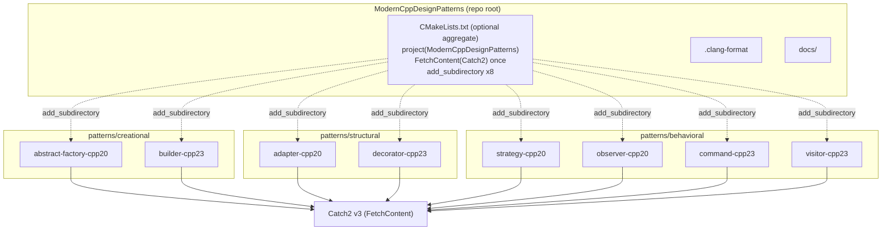
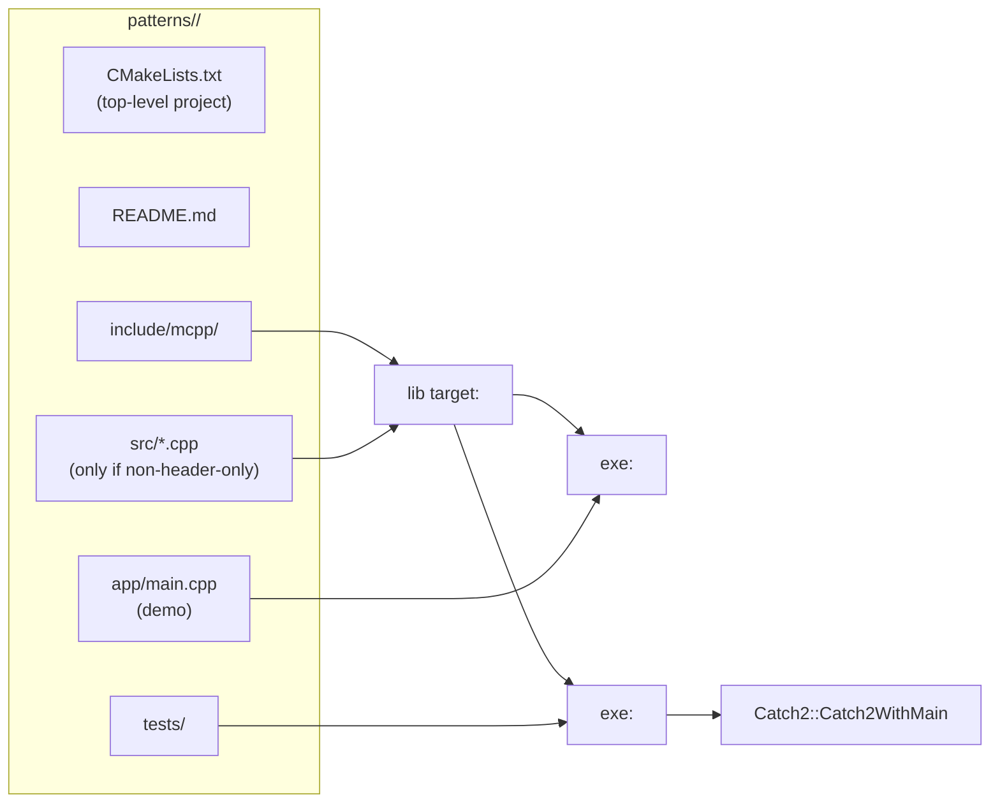

# Design Document Specification — Modern C++ Design Patterns

**Project:** vladiant/ModernCppDesignPatterns
**Document type:** Design Document Specification (portfolio project)
**Status:** Ready for C++ Developer implementation
**Date:** 2026-10-05
**Author:** System Architect
**Designs against:** `docs/requirements/SRS.md` (approved)

---

## 0. How to read this document

This document is prescriptive. The C++ Developer should be able to implement
every one of the 8 standalone pattern projects without making further
structural decisions. Where more than one reasonable option exists, the chosen
option and its trade-off are recorded under **Design Decisions & Trade-offs**
(Section 9) or inline.

Illustrative CMake and pseudo-C++ snippets appear throughout. They are
**contracts to follow**, not final source — the Developer writes the real code.
Interface signatures are normative; bodies shown are sketches.

---

## 1. Open-question resolutions (SRS §6)

These SRS open questions are resolved here with sensible defaults so the
Developer is unblocked. Each is a design decision of record.

| OQ | Question | Resolution (default) | Rationale |
|----|----------|---------------------|-----------|
| OQ-1 | Cross-platform build? | **Linux + g++ 13.3 / clang++ 18 only** this iteration. Code stays portable (no platform APIs), but only Linux is a committed target. | Matches A-3; avoids MSVC-specific `/W4`, `__has_include` churn. Portable code keeps the door open for a later iteration at zero cost. |
| OQ-2 | Test framework? | **Catch2 v3 via `FetchContent`.** Used identically across all 8 projects. | SRS NFR-5 recommendation; minimal boilerplate keeps pattern code front-and-center; `catch_discover_tests` gives clean CTest integration. |
| OQ-3 | Aggregate build / CI now? | **Provide the optional top-level aggregate `CMakeLists.txt` now** (FR-6). **Do not** author CI here — that is the Release Engineer's deliverable; Section 10 documents how CI should drive the aggregate build. | Aggregate build is cheap, enables one-command CI, and does not violate standalone-ness. |
| OQ-4 | Formatting / linting standard? | **Provide a repo-root `.clang-format` (LLVM base, 4-space indent, 100 col).** `clang-tidy` is **optional/non-blocking** this iteration. | Portfolio polish without gating builds. The `.clang-format` is a Developer deliverable; its exact keys are specified in Section 8.4. |
| OQ-5 | May the pattern↔standard mapping change? | **No change.** The SRS table is kept verbatim (4 C++20 / 4 C++23, all categories covered). | The mapping already yields strong, idiomatic demonstrations per pattern (Section 7). No cleaner arrangement found. |

Additional resolution:
- **NFR-3 warnings-as-errors mechanism:** a per-project cache **option
  `PATTERN_WERROR` (default `OFF`)**. CI flips it `ON` (`-DPATTERN_WERROR=ON`).
  Local/day-to-day builds stay friction-free. (The SRS suggested default ON for
  CI; we make the *option default* OFF and have CI opt in — same end state, more
  friendly locally. See Section 9, DD-6.)

---

## 2. Architecture Overview

The repository is a **collection of 8 mutually independent standalone CMake
projects**, grouped by GoF category. There is **no shared runtime library** and
**no cross-project code dependency** — each project is a self-contained unit so
it satisfies FR-1 (buildable in isolation). The only shared *concept* is a
repeated CMake boilerplate pattern (Section 5) and naming conventions
(Section 8), duplicated per project on purpose for standalone clarity.

An **optional aggregate `CMakeLists.txt`** at the repo root adds every project
via `add_subdirectory` purely for convenience and CI. It owns a single
`FetchContent` of Catch2 that all subprojects transparently reuse, so an
aggregate build fetches Catch2 **once**, while a standalone build of any single
project fetches (or finds) Catch2 for itself.



**Dependency direction:** aggregate → subprojects (build-time only, dashed).
Each subproject → Catch2 (test target only). No subproject → subproject edges.

### 2.1 Internal structure of one standalone project



---

## 3. Repository Layout

### 3.1 Naming convention for project directories

`patterns/<category>/<pattern-kebab>-cpp<std>/`

- `<category>` ∈ { `creational`, `structural`, `behavioral` } — encodes GoF
  category (satisfies NFR-6 "category obvious").
- `<pattern-kebab>` — the pattern name in kebab-case.
- `-cpp<std>` — `cpp20` or `cpp23`, so the target standard is visible in the
  path itself (supports FR-5 / self-describing portfolio, FR-7).

### 3.2 Full tree

```
ModernCppDesignPatterns/
├── CMakeLists.txt                      # OPTIONAL aggregate (project(ModernCppDesignPatterns))
├── .clang-format                       # repo-wide style (Section 8.4)
├── .gitignore                          # already present
├── LICENSE                             # MIT, already present
├── docs/
│   ├── requirements/SRS.md             # approved SRS
│   └── design/DESIGN.md                # THIS document (intended home)
└── patterns/
    ├── creational/
    │   ├── abstract-factory-cpp20/
    │   └── builder-cpp23/
    ├── structural/
    │   ├── adapter-cpp20/
    │   └── decorator-cpp23/
    └── behavioral/
        ├── strategy-cpp20/
        ├── observer-cpp20/
        ├── command-cpp23/
        └── visitor-cpp23/
```

### 3.3 Internal layout of **every** standalone project

Using `abstract-factory-cpp20` as the template (identical shape for all 8):

```
abstract-factory-cpp20/
├── CMakeLists.txt                      # valid top-level project() — buildable alone
├── README.md                           # pattern + standard + idiom (FR-7)
├── include/
│   └── mcpp/
│       └── abstract_factory/
│           ├── widgets.hpp             # concepts + product types
│           └── factories.hpp           # factory types + generic client
├── app/
│   └── main.cpp                        # demo (FR-2); defines int main()
└── tests/
    └── abstract_factory_test.cpp       # Catch2 TEST_CASEs (FR-3)
```

Rules:
- **Header-first.** Pattern projects here are small and idiom-centric; keep the
  pattern code in `include/mcpp/<pattern>/*.hpp` as an **INTERFACE** library.
  Add a `src/` with a **STATIC** library **only** if a pattern genuinely needs a
  non-template translation unit (none of the 8 require it — see each pattern in
  Section 7). This keeps demo and tests compiling the same headers with no
  divergence.
- `app/main.cpp` is the **only** file that defines `main()` for the demo.
- Catch2's `Catch2WithMain` provides `main()` for the test executable — tests
  must **not** define their own `main()`.
- Every project's `include/` root is `include/`, with the public header path
  `mcpp/<pattern>/...`, so `#include <mcpp/abstract_factory/factories.hpp>`
  works uniformly.

---

## 4. Test Framework Decision

**Confirmed: Catch2 v3, pinned tag `v3.7.1`, pulled via `FetchContent`.**
Registration with CTest uses **`catch_discover_tests`** (one CTest entry per
`TEST_CASE`, better granularity than a single `add_test`).

Canonical fetch + registration block (identical in every project; see Section 5
for where it sits):

```cmake
# --- Catch2 v3: reuse aggregate's copy if present, else find, else fetch ---
if(NOT TARGET Catch2::Catch2WithMain)
  find_package(Catch2 3 QUIET)
endif()
if(NOT TARGET Catch2::Catch2WithMain)
  include(FetchContent)
  FetchContent_Declare(
    Catch2
    GIT_REPOSITORY https://github.com/catchorg/Catch2.git
    GIT_TAG        v3.7.1
    GIT_SHALLOW    TRUE
  )
  FetchContent_MakeAvailable(Catch2)
endif()

# Make Catch.cmake (provides catch_discover_tests) available in both paths:
if(DEFINED catch2_SOURCE_DIR)                 # FetchContent path
  list(APPEND CMAKE_MODULE_PATH "${catch2_SOURCE_DIR}/extras")
endif()
include(Catch)                                # find_package path installs this module
```

**Single-fetch guarantee (DD-2):** `FetchContent` is keyed by the lowercase
name `catch2`. The aggregate root declares and makes Catch2 available *before*
`add_subdirectory`, so the `Catch2::Catch2WithMain` target already exists when
each subproject runs the block above — the `if(NOT TARGET ...)` guards make the
subproject a no-op reuse. A standalone build of one project has no such target,
so it finds an installed Catch2 or fetches its own. This satisfies "no refetch
per project in the aggregate build" while keeping each project truly standalone.

---

## 5. Per-project CMake Contract

Every `patterns/.../CMakeLists.txt` follows this reusable template. Shown for
`abstract-factory-cpp20` (C++ standard `20`); C++23 projects set `cxx_std_23`
and `CMAKE_CXX_STANDARD 23`. **Only three tokens change per project**: the
`project()` name, the standard number, and the pattern/target basename.

```cmake
cmake_minimum_required(VERSION 3.28)
project(abstract_factory_cpp20 LANGUAGES CXX)

# ---- standard enforcement (NFR-4) ----
set(CMAKE_CXX_STANDARD 20)                 # 23 for C++23 projects
set(CMAKE_CXX_STANDARD_REQUIRED ON)
set(CMAKE_CXX_EXTENSIONS OFF)

# ---- warnings policy (NFR-3) ----
option(PATTERN_WERROR "Treat compiler warnings as errors" OFF)

add_library(pattern_warnings INTERFACE)
target_compile_options(pattern_warnings INTERFACE
  -Wall -Wextra -Wpedantic
  $<$<BOOL:${PATTERN_WERROR}>:-Werror>)

# ---- the pattern code: header-only INTERFACE library ----
add_library(abstract_factory INTERFACE)
target_include_directories(abstract_factory INTERFACE
  "${CMAKE_CURRENT_SOURCE_DIR}/include")
target_compile_features(abstract_factory INTERFACE cxx_std_20)   # cxx_std_23 for C++23

# ---- demo executable (FR-2) ----
add_executable(abstract_factory_demo app/main.cpp)
target_link_libraries(abstract_factory_demo
  PRIVATE abstract_factory pattern_warnings)

# ---- tests (FR-3) : only when testing is on ----
include(CTest)                             # defines BUILD_TESTING (default ON)
if(BUILD_TESTING)
  # <Catch2 fetch + Catch module block from Section 4 goes here>

  add_executable(abstract_factory_tests tests/abstract_factory_test.cpp)
  target_link_libraries(abstract_factory_tests
    PRIVATE abstract_factory pattern_warnings Catch2::Catch2WithMain)

  catch_discover_tests(abstract_factory_tests)
endif()
```

Contract rules (apply to all 8):
- `project(<pattern>_cpp<std> LANGUAGES CXX)` — underscores in the CMake project
  name (CMake-friendly), kebab-case only in the *directory* name.
- Target names: library `<pattern>`, demo `<pattern>_demo`, tests
  `<pattern>_tests`. (e.g. `builder`, `builder_demo`, `builder_tests`.)
- `pattern_warnings` is an **INTERFACE** carrier for the warning flags; link it
  `PRIVATE` into demo + tests (never into the public INTERFACE lib, so a
  consumer isn't forced into our warning flags — though there are no external
  consumers, this is correct hygiene).
- `include(CTest)` (not bare `enable_testing()`) so `BUILD_TESTING` exists and
  CI can pass `-DBUILD_TESTING=OFF` to skip Catch2 entirely for a demo-only
  build.
- Do **not** hard-set `CMAKE_BUILD_TYPE`; let the invoker choose. CI uses
  `-DCMAKE_BUILD_TYPE=RelWithDebInfo` (Section 10).

### 5.1 Aggregate root `CMakeLists.txt` (optional, FR-6)

```cmake
cmake_minimum_required(VERSION 3.28)
project(ModernCppDesignPatterns LANGUAGES CXX)

include(CTest)                             # enable_testing for the whole tree

# Fetch Catch2 ONCE here; subprojects reuse the resulting target (Section 4).
if(BUILD_TESTING)
  include(FetchContent)
  FetchContent_Declare(
    Catch2
    GIT_REPOSITORY https://github.com/catchorg/Catch2.git
    GIT_TAG        v3.7.1
    GIT_SHALLOW    TRUE
  )
  FetchContent_MakeAvailable(Catch2)
  list(APPEND CMAKE_MODULE_PATH "${catch2_SOURCE_DIR}/extras")
endif()

add_subdirectory(patterns/creational/abstract-factory-cpp20)
add_subdirectory(patterns/creational/builder-cpp23)
add_subdirectory(patterns/structural/adapter-cpp20)
add_subdirectory(patterns/structural/decorator-cpp23)
add_subdirectory(patterns/behavioral/strategy-cpp20)
add_subdirectory(patterns/behavioral/observer-cpp20)
add_subdirectory(patterns/behavioral/command-cpp23)
add_subdirectory(patterns/behavioral/visitor-cpp23)
```

Note: mixing C++20 and C++23 subprojects in one tree is fine because each
subproject sets its standard via `target_compile_features`/`CMAKE_CXX_STANDARD`
in **its own** scope. The aggregate does not set a global `CMAKE_CXX_STANDARD`.

---

## 6. Common C++ Design Contracts (apply to all patterns)

- **Error handling.** Prefer `std::expected<T, E>` for *recoverable, expected*
  failures that are part of a pattern's contract (Builder validation, Command
  execute/undo). Use exceptions only for *programmer errors*/truly exceptional
  cases. No error codes via out-params. (DD-4.)
- **Ownership.** Default to **value semantics**. Use `std::unique_ptr` for
  polymorphic/owning tree nodes or command history. Use `std::shared_ptr` only
  where shared ownership is genuinely required (none of the 8 need it; Observer
  uses non-owning handles / `std::function`, see Section 7). **No raw owning
  pointers.** Raw pointers/references only for non-owning observation, and must
  not outlive the pointee.
- **Output.** Use `std::format` + `std::cout`/`std::ostream`. **Never**
  `std::print`/`std::println`, `std::generator`, `std::mdspan`, `std::flat_map`
  (libstdc++ 13 gap, A-1 / AC-6).
- **`const`-correctness & `[[nodiscard]]`.** Mark pure query methods `const`;
  mark `build()`, `execute()`, strategy results, and any `std::expected`-
  returning function `[[nodiscard]]`.
- **Namespaces.** Root `mcpp`; each pattern in `mcpp::<pattern>` (Section 8.1).

---

## 7. Per-pattern Low-level Design

Each subsection gives: domain, key types/interfaces, how the named modern idiom
is applied concretely, what the demo must show (FR-2), and what tests must
assert (FR-3). Signatures are normative; bodies are sketches.

---

### 7.1 Abstract Factory — Creational — **C++20**
*Idioms: `concepts` constraining product families; `std::format`.*

**Domain:** a UI theme toolkit. Two product families — **Light** and **Dark**
themes — each producing a `Button` and a `Checkbox`. A generic client renders a
dialog using whichever family it is given, with the family enforced by concepts
(value semantics, **no virtual inheritance** — the modern twist is that the
"abstract" contract is a *concept*, not a base class).

**Key types (`include/mcpp/abstract_factory/`):**

```cpp
namespace mcpp::abstract_factory {

// Product concepts — the "abstract products".
template <class T>
concept Button = requires(const T& b) {
    { b.render() } -> std::convertible_to<std::string>;
};

template <class T>
concept Checkbox = requires(const T& c) {
    { c.render() } -> std::convertible_to<std::string>;
};

// Abstract-factory concept — a family must make a Button and a Checkbox.
template <class F>
concept WidgetFactory = requires(const F& f) {
    { f.make_button()   };
    { f.make_checkbox() };
} && Button<decltype(std::declval<const F&>().make_button())>
  && Checkbox<decltype(std::declval<const F&>().make_checkbox())>;

// Concrete products (value types), e.g.:
struct LightButton   { std::string render() const; };   // std::format("[ {} ]", ...)
struct LightCheckbox { bool checked{}; std::string render() const; };
struct DarkButton    { std::string render() const; };
struct DarkCheckbox  { bool checked{}; std::string render() const; };

struct LightTheme { LightButton make_button() const; LightCheckbox make_checkbox() const; };
struct DarkTheme  { DarkButton  make_button() const; DarkCheckbox  make_checkbox() const; };

// Generic client constrained on the abstract-factory concept.
template <WidgetFactory F>
std::string render_dialog(const F& factory);   // uses std::format to lay out button+checkbox
}
```

**Idiom checkpoints a reviewer can see:** the three `concept` definitions;
`render_dialog` constrained by `WidgetFactory`; `std::format` inside `render()`
and `render_dialog`.

**Demo:** render a dialog with `LightTheme`, then `DarkTheme`; print both. Show
that a wrong-family mix is impossible (one commented static_assert or a note
that `render_dialog(int{})` fails to compile).

**Tests:** `render_dialog(LightTheme{})` and `render_dialog(DarkTheme{})`
produce the expected formatted strings; `static_assert(WidgetFactory<LightTheme>)`
and `static_assert(!WidgetFactory<int>)` hold; individual products' `render()`
output is correct.

---

### 7.2 Builder — Creational — **C++23**
*Idioms: deducing this (explicit object parameter) fluent interface;
`std::expected<T, Error>` validated `build()`.*

**Domain:** build an immutable `HttpRequest` (method, url, headers, body). The
fluent setters use **deducing this** so chaining preserves the caller's value
category (chaining on an rvalue returns rvalues → enables move-out; chaining on
an lvalue returns lvalue refs). `build()` validates and returns
`std::expected`.

**Key types (`include/mcpp/builder/`):**

```cpp
namespace mcpp::builder {

enum class BuildError { missing_url, invalid_method, empty_header_name };

struct HttpRequest {
    std::string method;
    std::string url;
    std::vector<std::pair<std::string, std::string>> headers;
    std::string body;
};

class RequestBuilder {
public:
    // Deducing this: Self&& is the builder's own ref category.
    template <class Self>
    auto&& method(this Self&& self, std::string m) {
        self.method_ = std::move(m);
        return std::forward<Self>(self);
    }
    template <class Self>
    auto&& url(this Self&& self, std::string u) {
        self.url_ = std::move(u);
        return std::forward<Self>(self);
    }
    template <class Self>
    auto&& header(this Self&& self, std::string name, std::string value) {
        self.headers_.emplace_back(std::move(name), std::move(value));
        return std::forward<Self>(self);
    }
    template <class Self>
    auto&& body(this Self&& self, std::string b) {
        self.body_ = std::move(b);
        return std::forward<Self>(self);
    }

    // Validated terminal op. [[nodiscard]]; returns value or error.
    [[nodiscard]] std::expected<HttpRequest, BuildError> build(this const RequestBuilder& self);
    // (Optionally an rvalue overload `build(this RequestBuilder&& self)` that moves fields out.)

private:
    std::string method_{"GET"};
    std::string url_;
    std::vector<std::pair<std::string, std::string>> headers_;
    std::string body_;
};
}
```

`build()` rules: empty `url_` → `std::unexpected(BuildError::missing_url)`;
method not in a small allowed set → `invalid_method`; any header with empty name
→ `empty_header_name`; otherwise the assembled `HttpRequest`.

**Idiom checkpoints:** every setter signature `(this Self&& self, ...)` with
`std::forward<Self>`; `build()` returns `std::expected<HttpRequest, BuildError>`
with `std::unexpected` on each failure path.

**Demo:** build a valid request via a fluent chain and print it (`std::format`);
build an invalid one (missing url) and print the `BuildError` branch; show an
rvalue chain (`RequestBuilder{}.method("POST").url("...").build()`).

**Tests:** valid chain → `expected.has_value()` with correct fields; missing url
→ `expected.error() == BuildError::missing_url`; bad method → `invalid_method`;
rvalue-chained temporary builds successfully (proves deducing-this ref-category
preservation compiles and works).

---

### 7.3 Adapter — Structural — **C++20**
*Idioms: `concepts` + `std::ranges`/views to adapt an incompatible interface.*

**Domain:** a **legacy sensor** with an index-based, Fahrenheit, non-range API
is adapted to a modern **`std::ranges` view of Celsius readings** that composes
with standard range adaptors.

**Key types (`include/mcpp/adapter/`):**

```cpp
namespace mcpp::adapter {

// Adaptee: incompatible legacy interface (no begin/end, Fahrenheit, by index).
class LegacySensor {
public:
    std::size_t count() const;
    double fahrenheit_at(std::size_t i) const;   // throws std::out_of_range if i>=count()
};

// Concept describing the shape the adapter can wrap (so the adapter is reusable).
template <class S>
concept IndexedFahrenheitSource = requires(const S& s, std::size_t i) {
    { s.count() }            -> std::convertible_to<std::size_t>;
    { s.fahrenheit_at(i) }   -> std::convertible_to<double>;
};

// Adapter: exposes a lazy ranges view of Celsius values.
template <IndexedFahrenheitSource S>
class CelsiusView {
public:
    explicit CelsiusView(const S& src);
    // Returns a view: iota(0..count) | transform(index -> celsius).
    auto celsius() const;   // std::ranges::view of double
};
}
```

`celsius()` returns, e.g.,
`std::views::iota(std::size_t{0}, src_.count()) | std::views::transform(to_celsius)`
where `to_celsius(i) = (src_.fahrenheit_at(i) - 32.0) * 5.0 / 9.0`.

**Idiom checkpoints:** the `IndexedFahrenheitSource` concept; the adapter body
composing `std::views::iota`/`std::views::transform`; demo piping the adapted
view through further adaptors (`std::views::filter`, `std::views::take`).

**Demo:** wrap a `LegacySensor`, then write an idiomatic pipeline, e.g.
`adapter.celsius() | std::views::filter(above_freezing) | std::views::take(3)`,
and `std::format`-print the results — showing the legacy API now flows through
standard ranges.

**Tests:** adapted Celsius values match expected conversions; the view composes
with `filter`/`take` and yields the right subset; the view is lazy (iterating
twice re-reads the source — assert values, not a snapshot).

---

### 7.4 Decorator — Structural — **C++23**
*Idioms: deducing this for recursive, type-preserving composition;
`static operator()` for stateless decorator layers.*

**Domain:** a **text-rendering pipeline**. A base source produces text; each
**layer** transforms `std::string -> std::string`. Stateless layers (e.g.
`Uppercase`, `Trim`) are implemented with **`static operator()`** (no per-object
state). A `Decorated` composition type uses **deducing this** so composing
layers builds a new, fully-typed composite (no type erasure, no `std::function`
in the hot path).

**Key types (`include/mcpp/decorator/`):**

```cpp
namespace mcpp::decorator {

// A layer is any invocable string(string).
template <class L>
concept Layer = std::invocable<L, std::string> &&
    std::convertible_to<std::invoke_result_t<L, std::string>, std::string>;

// Stateless layers: static operator() (C++23).
struct Uppercase { static std::string operator()(std::string s); };
struct Trim      { static std::string operator()(std::string s); };

// Stateful layer example: holds data, non-static operator().
struct Prefix { std::string tag; std::string operator()(std::string s) const; };

// Type-preserving composition via deducing this.
template <class Inner, Layer L>
class Decorated {
public:
    Decorated(Inner inner, L layer);

    // Apply inner first, then this layer. Deducing this lets .with(...) chain
    // while preserving/forwarding the composite's value category.
    std::string operator()(this const Decorated& self, std::string in);

    template <class Self, Layer Next>
    auto with(this Self&& self, Next next) {        // returns Decorated<Self-decayed, Next>
        return Decorated<std::remove_cvref_t<Self>, Next>{std::forward<Self>(self), next};
    }
private:
    Inner inner_;
    L     layer_;
};

// Seed a pipeline from a source callable (string()-like) or a plain string.
template <class Source>
auto decorate(Source src);   // returns a Decorated wrapping src with an identity base
}
```

**Idiom checkpoints:** `static std::string operator()(std::string)` on
`Uppercase`/`Trim`; `operator()(this const Decorated& self, ...)` and
`with(this Self&& self, ...)` using deducing this; the composite type grows at
compile time (`Decorated<Decorated<...>, Next>`).

**Demo:** build `decorate(base).with(Trim{}).with(Uppercase{}).with(Prefix{"[LOG] "})`
and print the result for a sample input, demonstrating ordered application and
that the composite is a concrete type (print `typeid`/a comment, or just the
output).

**Tests:** each stateless layer transforms correctly in isolation
(`Uppercase{}("abc") == "ABC"`); a composed pipeline applies layers in the
documented order; `static_assert(Layer<Uppercase>)` and
`static_assert(Layer<Prefix>)`; composition of three layers equals the manual
nested application.

---

### 7.5 Strategy — Behavioral — **C++20**
*Idioms: `std::invocable`/concepts; `std::span` over input; compile-time
strategy selection.*

**Domain:** a numeric **reducer** over `std::span<const double>` with pluggable
strategies (Sum, Mean, Max). The strategy is a concept-constrained callable;
selection can be **compile-time** (template parameter) so there is no virtual
dispatch.

**Key types (`include/mcpp/strategy/`):**

```cpp
namespace mcpp::strategy {

// A strategy reduces a span of doubles to a double.
template <class S>
concept ReduceStrategy =
    std::invocable<S, std::span<const double>> &&
    std::convertible_to<std::invoke_result_t<S, std::span<const double>>, double>;

// Strategies (C++20 → regular operator()).
struct Sum  { double operator()(std::span<const double> xs) const; };
struct Mean { double operator()(std::span<const double> xs) const; }; // 0.0 on empty
struct Max  { double operator()(std::span<const double> xs) const; }; // throws/empty policy: see note

// Context: compile-time strategy selection.
template <ReduceStrategy S>
double reduce(std::span<const double> data, S strategy = S{});
}
```

Empty-span policy (document in README + tests): `Sum` → 0.0; `Mean` → 0.0;
`Max` on empty **throws `std::invalid_argument`** (programmer-error style,
consistent with Section 6, so the return type stays a plain `double`). State
this clearly.

**Idiom checkpoints:** the `ReduceStrategy` concept built on `std::invocable`;
all inputs taken as `std::span<const double>`; `reduce(data, Sum{})` with
compile-time strategy type selection.

**Demo:** define a `std::vector<double>`, call `reduce(span, Sum{})`,
`reduce(span, Mean{})`, `reduce(span, Max{})`; also show passing a **lambda**
strategy (proving the concept accepts any invocable); `std::format`-print.

**Tests:** each strategy returns the correct value for a known dataset; a lambda
strategy satisfies `ReduceStrategy` and works; empty-span policy holds
(`Sum`/`Mean` → 0.0, `Max` throws); `static_assert(ReduceStrategy<Sum>)` and
`static_assert(!ReduceStrategy<int>)`.

---

### 7.6 Observer — Behavioral — **C++20**
*Idioms: `operator<=>` for subscriber ordering/dedup; `std::ranges` for
dispatch; `std::format`.*

**Domain:** a `Subject` broadcasting `Event`s to `Observer`s. Observers carry a
`priority` and `name`; the **`operator<=>`** on the observer handle orders
dispatch (lower priority value first, then name) and enables **dedup** (equal
handles are the same subscriber). Dispatch iterates with `std::ranges`.

**Key types (`include/mcpp/observer/`):**

```cpp
namespace mcpp::observer {

struct Event { std::string topic; std::string payload; };

class Observer {
public:
    Observer(int priority, std::string name, std::function<void(const Event&)> on_event);

    // Three-way comparison drives ordering AND dedup. Compare by (priority, name);
    // the callback is intentionally excluded from identity.
    std::strong_ordering operator<=>(const Observer& rhs) const;
    bool operator==(const Observer& rhs) const;   // in terms of (priority, name)

    int         priority() const;
    const std::string& name() const;
    void        notify(const Event& e) const;     // invokes callback
private:
    int priority_;
    std::string name_;
    std::function<void(const Event&)> on_event_;
};

class Subject {
public:
    bool subscribe(Observer obs);       // false if an equal observer already present (dedup)
    bool unsubscribe(const Observer& obs);
    void publish(const Event& e) const; // dispatch in <=> order via std::ranges
private:
    std::vector<Observer> observers_;   // kept sorted by operator<=>
};
}
```

Implementation guidance: keep `observers_` sorted on insert (binary search via
`std::ranges::lower_bound`); `subscribe` rejects a duplicate (equal under
`<=>`); `publish` does `std::ranges::for_each(observers_, [&](auto& o){ o.notify(e); })`
over the already-sorted vector. Ownership: `Subject` owns `Observer` values;
callbacks are `std::function` (non-owning of any external state the user
captures — document lifetime expectation).

**Idiom checkpoints:** `std::strong_ordering operator<=>` on `Observer`; sorted
dispatch and `std::ranges` algorithms in `Subject`; `std::format` in demo/event
rendering.

**Demo:** subscribe observers out of priority order with distinct names; publish
an event and show they fire in `<=>` order; attempt a duplicate subscribe and
show it is rejected (dedup); unsubscribe one and re-publish.

**Tests:** dispatch order equals the `<=>` order regardless of insertion order;
duplicate subscribe returns `false` and does not double-register; `<=>`
tie-break by name works; an unsubscribed observer no longer receives events.

---

### 7.7 Command — Behavioral — **C++23**
*Idioms: `std::expected` for `execute()`/`undo()`; `static operator()` for
stateless commands; `if consteval` for compile-time-validated commands.*

**Domain:** an integer **accumulator** (a tiny calculator) with an undoable
command stack. Commands mutate the accumulator and report success/failure via
`std::expected`. A stateless command uses **`static operator()`**. A
`constexpr` division helper uses **`if consteval`** to make a divide-by-zero a
*hard compile error* when the operands are known at compile time, but a
*runtime `std::expected` error* otherwise.

**Key types (`include/mcpp/command/`):**

```cpp
namespace mcpp::command {

enum class CommandError { divide_by_zero, nothing_to_undo, overflow };

struct Accumulator { long long value{0}; };

// constexpr helper showcasing if consteval.
constexpr std::expected<long long, CommandError>
safe_div(long long a, long long b) {
    if (b == 0) {
        if consteval {
            // Compile-time call with b==0 → make it ill-formed (not a constant expr).
            throw "divide by zero in constant evaluation";
        } else {
            return std::unexpected(CommandError::divide_by_zero);
        }
    }
    return a / b;
}

// Command contract (concept): execute/undo return std::expected<void, CommandError>.
template <class C>
concept Command = requires(C c, Accumulator& acc) {
    { c.execute(acc) } -> std::same_as<std::expected<void, CommandError>>;
    { c.undo(acc)    } -> std::same_as<std::expected<void, CommandError>>;
};

// Stateful command (holds operand).
struct AddCommand { long long operand;
    std::expected<void, CommandError> execute(Accumulator&) const;
    std::expected<void, CommandError> undo(Accumulator&) const; };

struct DivideCommand { long long divisor; long long previous{};   // previous for undo
    std::expected<void, CommandError> execute(Accumulator&);
    std::expected<void, CommandError> undo(Accumulator&) const; };

// Stateless command via static operator() — e.g. Negate (no operands/state).
struct Negate {
    static std::expected<void, CommandError> operator()(Accumulator& acc);  // acc.value = -acc.value
};

// Invoker: owns a history of applied commands and supports undo.
class CommandStack {
public:
    std::expected<void, CommandError> run(
        std::function<std::expected<void,CommandError>(Accumulator&)> cmd,
        std::function<std::expected<void,CommandError>(Accumulator&)> undo,
        Accumulator& acc);
    std::expected<void, CommandError> undo(Accumulator& acc); // nothing_to_undo if empty
private:
    std::vector<std::function<std::expected<void,CommandError>(Accumulator&)>> undo_stack_;
};
}
```

Note on the invoker: type-erasing commands into `std::function` pairs keeps
`CommandStack` non-templated and testable. (A fully static alternative with a
`std::variant` of command types is possible but heavier; DD-7 picks the
`std::function` history for clarity since this is a behavioral demo, not a
perf exercise.)

**Idiom checkpoints:** `std::expected<void, CommandError>` on every
`execute`/`undo`; `static std::expected<...> operator()` on `Negate`;
`if consteval` inside `safe_div`, used by `DivideCommand::execute`.

**Demo:** run a sequence (Add 5, Negate, Divide by 0 → show the
`std::expected` error branch, Add 2), printing each result; then `undo()` twice
and show the accumulator rewinds. Include a `static_assert(safe_div(10,2) == 5)`
and a commented line showing `safe_div(1,0)` fails to compile at constant-eval
(demonstrating `if consteval`).

**Tests:** successful commands update `Accumulator` and return a value;
`DivideCommand{0}.execute` returns `std::unexpected(divide_by_zero)` at runtime;
`undo` on empty stack returns `nothing_to_undo`; undo correctly reverses Add and
Divide; `Negate{}(acc)` (stateless static-call) negates; a `constexpr`/
`static_assert` test pins `safe_div` constant-eval behavior.

---

### 7.8 Visitor — Behavioral — **C++23**
*Idioms: `std::variant` + an `overloaded` visitor; recursion via deducing this.*

**Domain:** a small arithmetic **expression tree** modeled as a recursive
`std::variant` (`Number`, `Add`, `Mul`, `Neg`). Two operations — `evaluate` and
`to_string` — are implemented by visiting the variant with the classic
`overloaded` helper. **Recursion** over child nodes is done with a **deducing
this** lambda that calls itself without `std::function` or a named recursive
free function.

**Key types (`include/mcpp/visitor/`):**

```cpp
namespace mcpp::visitor {

struct Expr;                              // forward decl (recursive)
using ExprPtr = std::unique_ptr<Expr>;    // owning child edges

struct Number { double value; };
struct Add    { ExprPtr lhs; ExprPtr rhs; };
struct Mul    { ExprPtr lhs; ExprPtr rhs; };
struct Neg    { ExprPtr operand; };

struct Expr { std::variant<Number, Add, Mul, Neg> node; };

// Classic overloaded helper (aggregate + CTAD + using-declarations).
template <class... Ts> struct overloaded : Ts... { using Ts::operator()...; };
// (CTAD guide implicit in C++20+; add an explicit one if the chosen compiler needs it.)

// Factory helpers (value semantics in, unique_ptr out).
ExprPtr number(double v);
ExprPtr add(ExprPtr a, ExprPtr b);
ExprPtr mul(ExprPtr a, ExprPtr b);
ExprPtr neg(ExprPtr a);

double      evaluate(const Expr& e);     // see deducing-this recursion below
std::string to_string(const Expr& e);    // std::format-based pretty printer, same recursion
}
```

The deducing-this recursion pattern (the headline idiom) looks like:

```cpp
auto eval = [](this auto const& self, const Expr& e) -> double {
    return std::visit(overloaded{
        [](const Number& n) { return n.value; },
        [&](const Add& a)   { return self(*a.lhs) + self(*a.rhs); },
        [&](const Mul& m)   { return self(*m.lhs) * self(*m.rhs); },
        [&](const Neg& g)   { return -self(*g.operand); },
    }, e.node);
};
```

**Idiom checkpoints:** the `std::variant`-based `Expr`; the `overloaded`
helper with `using Ts::operator()...`; the `[](this auto const& self, ...)`
self-recursive lambda (deducing this) used by both `evaluate` and `to_string`.

**Demo:** build e.g. `add(mul(number(3), number(4)), neg(number(5)))`, print
`to_string` (expect something like `((3 * 4) + (-5))`) and `evaluate` (expect
`7`). Ownership is `unique_ptr`-based; moving the tree into the factories shows
RAII.

**Tests:** `evaluate` returns the right numbers for several trees (including
nesting and `Neg`); `to_string` matches the documented format; deeply nested
tree evaluates correctly; moving an `ExprPtr` into a factory transfers ownership
(no leaks — tested indirectly by correct results / optional ASan in CI).

---

## 8. Naming Conventions & C++ Style

### 8.1 Namespaces
- Root namespace: **`mcpp`** (Modern C++ Patterns).
- Per pattern: **`mcpp::<pattern>`** in `snake_case`:
  `mcpp::abstract_factory`, `mcpp::builder`, `mcpp::adapter`,
  `mcpp::decorator`, `mcpp::strategy`, `mcpp::observer`, `mcpp::command`,
  `mcpp::visitor`.
- No `using namespace` in headers. In `.cpp`/demo/tests, `using namespace
  mcpp::<pattern>;` at function/file scope is acceptable for brevity.

### 8.2 File naming
- Headers: `snake_case.hpp` under `include/mcpp/<pattern>/`.
- Sources (if any): `snake_case.cpp` under `src/`.
- Demo entry: `app/main.cpp`.
- Tests: `tests/<pattern>_test.cpp` (one file per project is enough; split only
  if it grows).

### 8.3 Identifiers
- Types / concepts: `PascalCase` (`RequestBuilder`, `WidgetFactory`,
  `ReduceStrategy`).
- Functions / methods / variables: `snake_case` (`make_button`, `render_dialog`).
- Private data members: trailing underscore (`url_`, `observers_`).
- Enums: `enum class PascalCase { snake_case_values }`.
- Prefer `constexpr`/`inline` constants over macros; avoid macros entirely.

### 8.4 `.clang-format` (repo root)
LLVM base with these overrides (Developer creates the file):
```yaml
BasedOnStyle: LLVM
IndentWidth: 4
ColumnLimit: 100
PointerAlignment: Left
AllowShortFunctionsOnASingleLine: Inline
```

### 8.5 RAII / ownership expectations
- Prefer value types and stack allocation.
- Owning polymorphic/tree edges → `std::unique_ptr` (Visitor `ExprPtr`;
  Command history entries are value `std::function`s).
- No `new`/`delete` in user code; use `std::make_unique`.
- Non-owning references (`const T&`, `std::span`, raw `T*` for observation) must
  not outlive their referent; document lifetime at the API boundary.
- `[[nodiscard]]` on all `std::expected`-returning and query functions.

---

## 9. Design Decisions & Trade-offs

| # | Decision | Alternatives considered | Why chosen |
|---|----------|------------------------|-----------|
| DD-1 | **8 independent standalone projects, no shared library.** | A shared `common` utility lib. | FR-1 demands isolation; a shared lib would couple projects and break "build any one alone". Minor CMake boilerplate duplication is accepted for standalone clarity. |
| DD-2 | **Catch2 fetched once at aggregate root; subprojects reuse via `if(NOT TARGET ...)`.** | (a) Each subproject always fetches (slow aggregate build, N clones). (b) Require a system-installed Catch2 (violates NFR-7/NFR-8). | Single clone in aggregate CI, yet standalone builds still self-provision. Keyed-by-name FetchContent makes reuse automatic. |
| DD-3 | **Header-first INTERFACE libraries; `src/` only if needed (none need it).** | Always-STATIC lib with split .hpp/.cpp. | The patterns are template/concept-heavy and small; header-only keeps demo and tests compiling identical code and reduces CMake surface. |
| DD-4 | **`std::expected` for recoverable contract failures; exceptions for programmer errors.** | Exceptions everywhere; error codes via out-params. | Matches SRS idiom goals (Builder/Command explicitly want `std::expected`); clearer, `[[nodiscard]]`-friendly. |
| DD-5 | **`catch_discover_tests` for CTest registration.** | Single `add_test(NAME ... COMMAND <tests>)`. | Per-`TEST_CASE` granularity; better CI reporting; standard Catch2 practice. |
| DD-6 | **`PATTERN_WERROR` cache option, default `OFF`; CI sets `ON`.** | Always `-Werror`; env-var toggle. | Friendly local builds, strict CI (AC-7). A named CMake option is discoverable and per-project. |
| DD-7 | **Command invoker uses `std::function` undo history (type erasure).** | `std::variant` of all command types; fully static. | Keeps `CommandStack` non-templated and trivially unit-testable; perf is a non-goal (SRS §7). |
| DD-8 | **Directory names encode `-cpp20`/`-cpp23`.** | Standard only in README/CMake. | Self-describing portfolio (FR-7/AC-4); reviewer sees the standard in the path. |
| DD-9 | **Observer stores sorted `std::vector<Observer>` with `<=>`-driven dedup.** | `std::set<Observer>` keyed by `<=>`. | A sorted vector showcases `<=>` + `std::ranges` algorithms explicitly (the idiom to demonstrate) and is cache-friendly; `std::set` would hide the comparison behind the container. |
| DD-10 | **Linux-only commitment, portable code.** | Commit to MSVC/macOS now. | SRS A-3/OQ-1; avoids widening NFR-1 scope mid-iteration while keeping future portability free. |

---

## 10. CI-friendliness Notes (for the Release Engineer — informational only)

Do **not** treat this as the CI deliverable; it documents how the design
supports CI so the Release Engineer can author the pipeline.

- **One-command aggregate build & test** (both compilers, strict warnings):
  ```bash
  cmake -S . -B build -G Ninja \
        -DCMAKE_CXX_COMPILER=g++-13 \
        -DPATTERN_WERROR=ON \
        -DCMAKE_BUILD_TYPE=RelWithDebInfo
  cmake --build build
  ctest --test-dir build --output-on-failure
  ```
  Repeat with `-DCMAKE_CXX_COMPILER=clang++-18` in a separate build dir.
- **Standalone verification** (proves FR-1 / AC-1): the pipeline should also
  configure+build **at least one** project from its own directory, e.g.
  `cmake -S patterns/behavioral/visitor-cpp23 -B /tmp/vis && cmake --build /tmp/vis && ctest --test-dir /tmp/vis`.
  A matrix over all 8 standalone builds is ideal.
- **Catch2 is fetched once** per aggregate configure (DD-2); CI can cache the
  `_deps/` or the Git clone to speed reruns.
- **Demo exit codes** (AC-2): CI may run each `*_demo` and assert exit 0.
- **Optional sanitizers:** the design is ASan/UBSan-clean by construction
  (RAII, no raw owning pointers). CI may add
  `-DCMAKE_CXX_FLAGS="-fsanitize=address,undefined"` for an extra job; this is a
  suggestion, not a requirement.
- CI should pass `-DBUILD_TESTING=ON` (default) for test jobs and may pass
  `-DBUILD_TESTING=OFF` for a fast demo-only build.

---

## 11. Testability Check

- **No singletons;** all collaborators are passed in (Strategy/Command take the
  context/accumulator as parameters; Observer `Subject` is a plain object).
  Dependency injection over globals → unit tests need no special setup.
- **Interfaces are concepts or small value types**, so tests construct real
  objects instead of mocks — minimal mocking, matching the portfolio-clarity
  goal.
- **`std::expected` returns** make error paths assertable without exception
  gymnastics.
- **Pure functions** (`evaluate`, `reduce`, `render_dialog`, layer
  `operator()`s) are directly assertable.
- The only external dependency (Catch2) is test-only and FetchContent-provided
  (NFR-7/AC-8).

---

## 12. Risks

| # | Risk | Likelihood | Impact | Mitigation |
|---|------|-----------|--------|-----------|
| R-1 | **libstdc++ 13 library gaps** (A-1) tempt use of `std::print`/`std::generator`. | Med | High (AC-6 fail) | Section 6 hard-bans them; use `std::format` + streams. Developer checklist + CI `-Werror`. |
| R-2 | **Deducing-this / `static operator()` compiler quirks** across g++ 13.3 and clang++ 18. | Low–Med | Med | Both verified to compile `-std=c++23`. Keep usages canonical (as sketched); CI builds both compilers early. |
| R-3 | **FetchContent reuse ordering** subtly refetches Catch2 per subproject. | Low | Low (slow build) | DD-2 `if(NOT TARGET ...)` guards + aggregate pre-fetch; CI asserts single clone. |
| R-4 | **`catch_discover_tests` module path** not found on the FetchContent path. | Low | Med (tests not registered) | Section 4 snippet appends `${catch2_SOURCE_DIR}/extras` to `CMAKE_MODULE_PATH` before `include(Catch)`. |
| R-5 | **`if consteval` demo** (Command) hard-errors unexpectedly if a constant-folded call hits the zero branch. | Low | Low | Only the explicitly-commented `safe_div(1,0)` line triggers it; keep runtime paths using non-constant operands. |
| R-6 | **Boilerplate drift** across 8 duplicated CMakeLists. | Med | Low | Section 5 is the single source of truth; only 3 tokens differ per project; reviewer/CI builds all 8. |
| R-7 | **Scope creep** (adding install/export targets, more patterns). | Low | Med | Out of scope per SRS §7; flag back to Requirements Analyst, do not add unilaterally. |

**Requirement-gap flag:** none found — the SRS fully covers the 8-pattern,
dual-standard, standalone-project scope. No new requirement needs to go back to
the Requirements Analyst at this time. (Should the Developer discover a genuine
gap, route it back rather than deciding unilaterally.)

---

## 13. Handoff

**Final directory layout (create under `patterns/`):**

```
patterns/
├── creational/
│   ├── abstract-factory-cpp20/    (lib: abstract_factory | demo | tests)
│   └── builder-cpp23/             (lib: builder | demo | tests)
├── structural/
│   ├── adapter-cpp20/             (lib: adapter | demo | tests)
│   └── decorator-cpp23/           (lib: decorator | demo | tests)
└── behavioral/
    ├── strategy-cpp20/            (lib: strategy | demo | tests)
    ├── observer-cpp20/            (lib: observer | demo | tests)
    ├── command-cpp23/             (lib: command | demo | tests)
    └── visitor-cpp23/             (lib: visitor | demo | tests)
```
Plus repo-root `.clang-format` and the optional aggregate `CMakeLists.txt`.

**Recommended implementation order** (C++20 patterns first to validate the
shared CMake contract on the simpler standard, then C++23):

1. `strategy-cpp20` — simplest; validates the per-project CMake + Catch2 + CTest contract end-to-end.
2. `abstract-factory-cpp20` — concepts + `std::format`.
3. `adapter-cpp20` — concepts + `std::ranges` views.
4. `observer-cpp20` — `operator<=>` + ranges dispatch.
5. `builder-cpp23` — deducing this + `std::expected` (first C++23).
6. `decorator-cpp23` — deducing this + `static operator()`.
7. `command-cpp23` — `std::expected` + `static operator()` + `if consteval`.
8. `visitor-cpp23` — `std::variant` + `overloaded` + deducing-this recursion.

After #1, add the aggregate root `CMakeLists.txt` and wire each subsequent
project into it.

**Design is ready for the C++ Developer agent to implement.**

---
---

## C++26 Idiom Tier — Design

**Designs against:** `docs/requirements/SRS.md` §10 ("Addendum — C++26 Idiom
Tier"), FR-C26-1 … FR-C26-10, NFR-C26-1 … NFR-C26-9, A-C26-1 … A-C26-6.
**Baseline toolchain:** g++-14 (14.2) with `-std=c++26` (`__cplusplus ==
202400`), Ubuntu 24.04, CMake ≥ 3.28, Catch2 v3.7.1. **clang-18 is explicitly
out of scope for this tier** — it cannot drive `-std=c++26` fully and lacks the
library facilities (A-C26-1, NFR-C26-1).

This section is an **addendum**: it adds a fourth standard grouping to the
repository without altering the C++20/C++23 tiers above. It follows the same
prescriptive, contract-first style — interface signatures are normative, bodies
are sketches, and every multi-option decision is recorded under
**Design Decisions (DD-C26-n)** in §C26.9.

### C26.0 SRS open-question resolutions

| OQ | Question | Resolution | DD |
|----|----------|-----------|----|
| OQ-C26-1 | Reflection build-gate mechanism/name | CMake option **`PATTERN_ENABLE_REFLECTION`** (default `OFF`) **plus** a `__cpp_reflection` feature probe; aggregate never adds the subdir unless the option is ON. | DD-C26-8 |
| OQ-C26-2 | Shim shared vs per-project | **Per-project `compat.hpp`** (one copy in each of the 4 projects), in namespace **`gof`**. Keeps every project standalone (FR-C26-2). | DD-C26-3 |
| OQ-C26-3 | One aggregate/CI entry point for all 3 (now 4) standard tiers, or separate? | **One shared aggregate** root `CMakeLists.txt`; the C++26 grouping is wired behind a new **`PATTERN_ENABLE_CPP26`** option (default `OFF`) so non-g++-14 jobs are unaffected and CI stays green. | DD-C26-9 |

### C26.1 Architecture Overview

Unlike the C++20/C++23 tiers (one standalone project **per pattern**), the
C++26 tier has **21 buildable patterns + 1 gated reflection showcase** — far too
many for one-per-pattern without drowning the repo in near-identical CMake
boilerplate. The stakeholder also supplied the nine behavioral patterns as a
**single grouped reference translation unit** (`file_behavioral.cpp`), which
establishes the grouping granularity and the exact `compat.hpp` surface.

**Decision (DD-C26-1):** deliver the tier as **four standalone CMake projects,
grouped by GoF category**, each with its own `project()`, `compat.hpp`, runnable
`_demo`, Catch2 tests, and README:

| Project | Directory | Patterns |
|---------|-----------|----------|
| `creational_cpp26` | `patterns/creational/creational-cpp26/` | C1 Singleton, C2 Factory Method, C3 Abstract Factory, C4 Builder, C5 Prototype |
| `structural_cpp26` | `patterns/structural/structural-cpp26/` | C6 Adapter, C7 Bridge, C8 Composite, C9 Decorator, C10 Facade, C11 Flyweight, C12 Proxy |
| `behavioral_cpp26` | `patterns/behavioral/behavioral-cpp26/` | C13 Strategy, C14 Observer, C15 Command, C16 State, C17 Visitor/Interpreter, C18 Template Method, C19 Iterator, C20 Chain of Responsibility, C21 Memento |
| `reflection_cpp26` **(gated)** | `patterns/reflection/reflection-cpp26/` | C22 Reflection showcase — **excluded from default/CI build** (DD-C26-8) |

A **fifth** category directory `patterns/reflection/` is introduced (the GoF
has no "reflection" category; C22 is a language-feature showcase, so it earns
its own grouping rather than being wedged into creational/structural/behavioral).
This keeps the self-describing path convention intact (`patterns/<group>/`).

```mermaid
graph TD
    subgraph Repo["ModernCppDesignPatterns (repo root)"]
        AGG["CMakeLists.txt (aggregate)\nPATTERN_ENABLE_CPP26 (OFF)\nPATTERN_ENABLE_REFLECTION (OFF)\nFetchContent(Catch2) once"]
    end

    subgraph C26["C++26 tier (g++-14 -std=c++26)"]
        CR["creational-cpp26\n(C1–C5)"]
        SR["structural-cpp26\n(C6–C12)"]
        BE["behavioral-cpp26\n(C13–C21)"]
        RF["reflection-cpp26\n(C22, GATED)"]
    end

    AGG -. "add_subdirectory (if PATTERN_ENABLE_CPP26)" .-> CR
    AGG -. .-> SR
    AGG -. .-> BE
    AGG -. "add_subdirectory (ONLY if PATTERN_ENABLE_REFLECTION)" .-> RF

    Catch2["Catch2 v3.7.1 (FetchContent, test-only)"]
    CR --> Catch2
    SR --> Catch2
    BE --> Catch2

    CR -. "has own" .-> SHIM1["compat.hpp (gof::)"]
    SR -. .-> SHIM2["compat.hpp (gof::)"]
    BE -. .-> SHIM3["compat.hpp (gof::)"]
    RF -. .-> SHIM4["compat.hpp (gof::)"]
```

**Dependency direction:** aggregate → the three buildable C++26 projects
(build-time only, dashed, behind `PATTERN_ENABLE_CPP26`); reflection is wired in
**only** behind `PATTERN_ENABLE_REFLECTION`. No project→project edges; each ships
its own `compat.hpp` (DD-C26-3). The three buildable projects reuse the
aggregate's single Catch2 (DD-2, unchanged).

### C26.2 Project internal layout

**Pattern logic is header-only** (one header per pattern), `app/main.cpp` is a
thin narrative demo, and `tests/` holds Catch2 TUs. The stakeholder reference
(`file_behavioral.cpp`) is a *single demo+logic TU*; we **split it** so Catch2
tests can `#include` and assert on the pattern logic directly, matching the
existing tiers' testability contract (DD-C26-2, DD-C26-12).

`behavioral-cpp26/` shown as the template (the other three have the same shape):

```
behavioral-cpp26/
├── CMakeLists.txt                       # standalone project(behavioral_cpp26)
├── README.md                            # patterns + C++26 + idioms + active shims (FR-C26-9)
├── include/
│   └── mcpp/
│       └── behavioral26/
│           ├── compat.hpp               # namespace gof (per-project copy, DD-C26-3)
│           ├── strategy.hpp             # C13
│           ├── observer.hpp             # C14
│           ├── command.hpp              # C15
│           ├── state.hpp                # C16
│           ├── interpreter.hpp          # C17 (visitor/interpreter)
│           ├── template_method.hpp      # C18
│           ├── iterator.hpp             # C19
│           ├── chain.hpp                # C20
│           └── memento.hpp              # C21
├── app/
│   └── main.cpp                         # one narrative demo exercising all 9 (FR-C26-3)
└── tests/
    ├── strategy_test.cpp
    ├── observer_test.cpp
    ├── command_test.cpp
    ├── state_test.cpp
    ├── interpreter_test.cpp
    ├── template_method_test.cpp
    ├── iterator_test.cpp
    ├── chain_test.cpp
    └── memento_test.cpp
```

Rules (all four projects):
- **Header-first, INTERFACE library** per project (`behavioral26`,
  `creational26`, `structural26`, `reflection26`). Pattern code lives entirely
  in `include/mcpp/<group>26/*.hpp`; no `src/` (DD-C26-2).
- **`compat.hpp` sits beside the pattern headers** in
  `include/mcpp/<group>26/compat.hpp`, so a pattern header's `#include
  "compat.hpp"` resolves relatively (matching the reference file) while demo/test
  TUs use the full path `<mcpp/<group>26/strategy.hpp>`.
- **One demo** `app/main.cpp` per project narrates every pattern in the group
  (the behavioral demo is the reference file's `main()` body, re-pointed at the
  split headers). Exit code 0, human-readable output (AC-C26-2).
- **Tests**: one TU per pattern, all compiled into a single
  `<group>26_tests` executable; `Catch2WithMain` supplies `main()`;
  `catch_discover_tests` registers one CTest entry per `TEST_CASE`
  (AC-C26-3).
- **Namespace deviation:** the shim lives in **`gof`** (not `mcpp::...`) because
  the stakeholder reference and the "retire GoF boilerplate" narrative read best
  with `gof::function_ref`, `gof::overloaded`, `gof::polymorphic`,
  `gof::indirect`. Pattern *logic* still lives in `mcpp::<group>26::...`. Only
  the shim types are in `gof` (DD-C26-3).

### C26.3 The compatibility shim — `compat.hpp` (normative API contract)

`compat.hpp` selects the **real standard type when its feature-test macro is
defined**, else provides a minimal, honest fallback (A-C26-2, FR-C26-7,
NFR-C26-3). The developer must unit-test each fallback. Verified facts on
g++-14 `-std=c++26`: `generator`, `move_only_function`, `expected`, and
*deducing this* are **present** (used directly, NFR-C26-2); `function_ref`,
`polymorphic`, `indirect`, and reflection are **absent** (shimmed/gated).

**Feature-test macros used (DD-C26-4):**

| Facility | Macro probed | g++-14 `-std=c++26` | compat action |
|----------|--------------|---------------------|---------------|
| `std::function_ref` | `__cpp_lib_function_ref` | absent | `gof::function_ref` fallback |
| `std::polymorphic` | `__cpp_lib_polymorphic` | absent | `gof::polymorphic` fallback |
| `std::indirect` | `__cpp_lib_indirect` | absent | `gof::indirect` fallback |
| `std::generator` | `__cpp_lib_generator` | **present** | used directly (guarded at call sites, DD-C26-11) |
| `std::move_only_function` | `__cpp_lib_move_only_function` | present | used directly (no shim) |
| `std::expected` | `__cpp_lib_expected` | present | used directly (no shim) |
| P2996 reflection | `__cpp_reflection` | absent | project build-gated (DD-C26-8) |
| `gof::overloaded` | *(no std type)* | n/a | **always** provided by the shim |

The selection idiom (sketch, repeated per type):
```cpp
// compat.hpp — namespace gof
#if defined(__cpp_lib_function_ref)
  #include <functional>
  namespace gof { template <class Sig> using function_ref = std::function_ref<Sig>; }
#else
  namespace gof { /* fallback definition below */ }
#endif
```

#### C26.3.1 `gof::overloaded` (always shim-provided)
Classic aggregate-of-lambdas + deduction guide. No standard type exists, so it
is **unconditionally** defined.
```cpp
namespace gof {
template <class... Ts> struct overloaded : Ts... { using Ts::operator()...; };
template <class... Ts> overloaded(Ts...) -> overloaded<Ts...>;   // deduction guide
}
```
Contract: usable as the single-visitor argument to `std::visit`. Used by C8,
C16, C17.

#### C26.3.2 `gof::function_ref<Sig>` (DD-C26-5)
**Non-owning** reference to any callable with signature `Sig`. Prefer
`std::function_ref` when `__cpp_lib_function_ref` is defined. Fallback contract:

```cpp
namespace gof {
template <class Sig> class function_ref;                 // primary left undefined

template <class R, class... Args>
class function_ref<R(Args...)> {
public:
    // Bind to any lvalue/temporary callable f with compatible signature.
    // Precondition: f outlives this function_ref (non-owning).
    template <class F>
        requires (!std::same_as<std::remove_cvref_t<F>, function_ref>) &&
                 std::invocable<F&, Args...>
    function_ref(F&& f) noexcept;                        // stores &f + thunk

    function_ref(const function_ref&) noexcept = default;    // trivially copyable
    function_ref& operator=(const function_ref&) noexcept = default;

    R operator()(Args... args) const;                    // forwards to the referent
private:
    void* obj_{};
    R (*thunk_)(void*, Args...){};
};

// Second specialization for const-qualified call: function_ref<R(Args...) const>
}
```
- **No empty/null state** (mirrors `std::function_ref`): there is no default
  constructor that produces a callable-but-empty object; constructing always
  binds to a referent. (If a sentinel is ever needed, document calling it as UB.)
- **Lifetime:** non-owning — the referent must outlive the `function_ref`. This
  is exactly its value: zero allocation per call (C13 per-call strategy, C19
  internal-iterator fallback).
- **Two signature forms** must be supported: `R(Args...)` and
  `R(Args...) const` (the reference uses `bool(int,int)` and `void(int)`).

#### C26.3.3 `gof::polymorphic<T>` (DD-C26-6)
**Value type with deep-copy semantics**: copying the wrapper deep-clones the
owned object, including a derived dynamic type. Prefer `std::polymorphic` when
`__cpp_lib_polymorphic` is defined. Fallback contract:

```cpp
namespace gof {
template <class T>
class polymorphic {
public:
    // Own a concrete U (U == T or U publicly derived from T), captured by value.
    template <class U = T>
        requires std::derived_from<std::remove_cvref_t<U>, T> ||
                 std::same_as<std::remove_cvref_t<U>, T>
    explicit polymorphic(U u);

    template <class U, class... Args>
    explicit polymorphic(std::in_place_type_t<U>, Args&&... args);

    polymorphic(const polymorphic& other);               // deep clone via stored copier
    polymorphic(polymorphic&& other) noexcept;            // steal; other becomes valueless
    polymorphic& operator=(const polymorphic&);
    polymorphic& operator=(polymorphic&&) noexcept;
    ~polymorphic();

    T&       operator*()        noexcept;   const T& operator*()  const noexcept;
    T*       operator->()       noexcept;   const T* operator->() const noexcept;
private:
    T*  ptr_{};                       // owned, dynamic type may be derived
    T* (*clone_)(const T*){};         // copier instantiated knowing concrete U
    void(*destroy_)(T*){};            // deleter instantiated knowing concrete U
};
}
```
**Fallback mechanism (honest):** the copier/deleter function pointers are
instantiated *from the concrete `U`* at the constructing call site, so a copy
reconstructs `new U(*static_cast<const U*>(src))` and deep-clones the **dynamic**
type without needing a virtual `clone()`. This mirrors how `std::polymorphic`
captures the concrete type — user code (C5, C7, C9) is unchanged whether the
real or fallback type is active.

**Documented fallback limits (A-C26-2):**
- Each constructing `U` must be **copy-constructible** and complete at the
  construction site.
- `U` must be publicly derived from (or equal to) `T` so `U* → T*` is valid.
- **No allocator / `memory_resource` support, not `constexpr`-usable**, no
  incomplete-type support beyond the construction site. The shim is a
  demonstration aid, not a production reimplementation (A-C26-2).
- The README of each project using it states "fallback `gof::polymorphic` active
  on g++-14" (FR-C26-9).

#### C26.3.4 `gof::indirect<T>` (DD-C26-7)
**Value type holding a heap `T` with value (non-polymorphic) copy semantics** —
used for recursive data types (C17 `Expr`). Prefer `std::indirect` when
`__cpp_lib_indirect` is defined. Fallback contract:

```cpp
namespace gof {
template <class T>
class indirect {
public:
    indirect() requires std::default_initializable<T>;   // allocates a default T
    template <class... Args>
    explicit indirect(std::in_place_t, Args&&... args);   // allocates T(args...)

    indirect(const indirect& other);                      // deep copy: new T(*other)
    indirect(indirect&& other) noexcept;                  // steal; other becomes valueless
    indirect& operator=(const indirect&);
    indirect& operator=(indirect&&) noexcept;
    ~indirect();

    T&       operator*()        &  noexcept;  const T& operator*()  const& noexcept;
    T*       operator->()          noexcept;  const T* operator->() const  noexcept;
private:
    T* ptr_{};                                            // sole owned heap box
};
}
```
- Copy = deep copy of the single stored `T` (value semantics, **not**
  polymorphic — no dynamic-type cloning, by design distinct from `polymorphic`).
- **Moved-from state is valueless**: `ptr_ == nullptr`; dereferencing a
  moved-from `indirect` is UB (documented). This matches the reference's
  `std::in_place` construction of `BinOp` children.

### C26.4 Per-pattern idiom mapping → demo scenario (FR-C26-5)

Each row gives the concrete, reviewer-legible scenario and the visible C++26
idiom (SRS §10.2 catalogue). **C13–C21 are seeded by the stakeholder reference
`file_behavioral.cpp`** — the design adopts its scenarios verbatim and splits its
logic into the headers of §C26.2 (DD-C26-12). That file also fixes the required
`compat.hpp` surface (`gof::function_ref`, `gof::overloaded`, `gof::indirect`,
`std::move_only_function`, guarded `std::generator`, deducing this).

**Creational — `creational-cpp26` (C1–C5):**

| # | Pattern | Idiom (visible) | Demo scenario |
|---|---------|-----------------|---------------|
| C1 | Singleton | `= delete("reason")` | An `AppConfig` single-instance accessor; copy/move ctors are `= delete("AppConfig is a process-wide singleton; take a const& instead")`, so a copy attempt yields a *readable* diagnostic (demo shows a commented line that fails to compile). |
| C2 | Factory Method | `std::move_only_function` creators + `std::expected` | A `ShapeFactory` registry mapping a name → move-only creator closure; `create("hexagon")` returns `std::expected<Shape, FactoryError>`, unknown key → `std::unexpected(unknown_kind)`. |
| C3 | Abstract Factory | concepts over "theme" types | Light/Dark `WidgetFactory` families constrained by a `WidgetFactory` concept (no virtual factory base); a generic client renders a dialog from whichever family it is handed. |
| C4 | Builder | deducing this (`this auto&& self`) | An immutable `HttpRequest` fluent builder; setters `(this Self&& self, …)` preserve value category so an rvalue chain moves out; `build()` → `std::expected`. |
| C5 | Prototype | `gof::polymorphic<T>` (copy = deep clone) | A `Shape` prototype registry storing `gof::polymorphic<Shape>`; cloning a registered prototype is a **plain copy** — no virtual `clone()`. |

**Structural — `structural-cpp26` (C6–C12):**

| # | Pattern | Idiom (visible) | Demo scenario |
|---|---------|-----------------|---------------|
| C6 | Adapter | concept as the target interface | A legacy index/Fahrenheit sensor adapted to satisfy a modern `TemperatureSource` **concept** (the "target" is a concept, not an abstract base). |
| C7 | Bridge | `gof::polymorphic<Impl>` member | A `Window` abstraction holding a value `gof::polymorphic<Renderer>` implementor; the bridge is value-semantic and deep-copyable (no raw/unique pointer to impl). |
| C8 | Composite | `std::variant` + recursive lambda via deducing this | A filesystem tree (`File` / `Directory` in a `variant`); total size computed by a `[](this auto&& self, …)` self-recursive lambda — no virtual `Component`. |
| C9 | Decorator | layers owned as `gof::polymorphic` | A `Notifier` base wrapped by `SMS`/`Email`/`Slack` decorators, each layer owned as `gof::polymorphic<Notifier>` (copy deep-clones the whole stack; no manual clone plumbing). |
| C10 | Facade | `std::expected::transform` chain | An `OrderFacade` chaining `validate()` → `charge()` → `ship()` with `std::expected::transform`/`and_then`, flattening nested error checks. |
| C11 | Flyweight | `std::shared_ptr<const T>` cache | A `GlyphCache` interning immutable glyphs as `shared_ptr<const Glyph>`; repeated characters share one instance. |
| C12 | Proxy | `std::call_once` lazy load | A virtual proxy for an expensive `Image`; the real resource is loaded exactly once via `std::call_once` + `std::once_flag` (replaces a hand-rolled flag+mutex). |

**Behavioral — `behavioral-cpp26` (C13–C21, seeded by the reference file):**

| # | Pattern | Idiom (visible) | Demo scenario (from `file_behavioral.cpp`) |
|---|---------|-----------------|--------------------------------------------|
| C13 | Strategy | `gof::function_ref` (per call) + `std::move_only_function` (stored) | `sort_with(vec, order)` takes a per-call `function_ref<bool(int,int)>`; `Checkout` stores a `move_only_function<double(double) const>` pricing strategy. |
| C14 | Observer | `Signal<Args...>` of move-only slots | `Signal<std::string_view,int> price_changed`; slots are `move_only_function` (may own a `unique_ptr`); `connect`/`disconnect`/`emit`. |
| C15 | Command | do/undo closure pairs | `History` of `Command{label, redo, undo}` move-only closures over a text document; execute / undo / redo. |
| C16 | State | `variant` states × events, one `std::visit` | Media player: `variant<Idle,Playing,Paused>` × `variant<Play,Pause,Stop>` resolved by a single `std::visit(gof::overloaded{…})` transition table. |
| C17 | Visitor/Interpreter | `std::visit` + `gof::overloaded`, `gof::indirect` for recursion | Arithmetic AST `Expr = variant<Num,BinOp>` with `gof::indirect<Expr>` children; `eval`/`show` are overload sets — new ops without `accept()/visit()`. |
| C18 | Template Method | deducing this + `requires` on hooks | `Exporter::run(this auto&& self) requires { self.open(); self.write_rows(); self.close(); }`; `CsvExporter`/`JsonExporter` supply hooks — no virtuals/CRTP. |
| C19 | Iterator | `std::generator` (internal-iterator fallback) | In-order binary-tree traversal as `std::generator<int>` when `__cpp_lib_generator` is defined, else an internal iterator driven by `gof::function_ref<void(int)>` (DD-C26-11). |
| C20 | Chain of Responsibility | `std::optional`-returning handlers | `ApprovalChain` of `move_only_function<optional<string>(const Request&) const>` handlers; first engaged (non-`nullopt`) result wins. |
| C21 | Memento | plain value copy | `Editor::Snapshot` is a plain copy of `(text, cursor)`; `save()`/`restore()` — no friend-access snapshot class. |

**Reflection showcase — `reflection-cpp26` (C22, GATED, DD-C26-8):**

| # | Pattern | Idiom | Demo scenario |
|---|---------|-------|---------------|
| C22 | Reflection showcase | `^^T`, `[: :]`, `template for` | Generate a generic `to_string(const Aggregate&)` / field enumerator over an arbitrary aggregate using P2996 reflection + `template for`, replacing hand-written per-type switches. **Source committed, excluded from default/CI build** (requires an experimental reflection compiler). |

### C26.5 Reflection gating mechanism (FR-C26-8, A-C26-3, DD-C26-8)

P2996 reflection builds on **no** compiler available here. The showcase is
committed as source but must never reach the default/CI build or break it
(NFR-C26-4, AC-C26-6/7). Two-layer gate:

1. **Aggregate layer (primary):** the root `CMakeLists.txt` adds the reflection
   subdir **only** when `PATTERN_ENABLE_REFLECTION` (default `OFF`) is `ON`. CI
   never sets it → the project is never configured in CI → CI stays green.
2. **Standalone / belt-and-braces layer:** `reflection-cpp26/CMakeLists.txt`
   additionally probes the compiler for reflection support and, if absent,
   **configures but builds nothing**, printing a clear SKIP status. So even a
   developer who configures the project directly without a reflection compiler
   gets a green, no-op configure instead of a hard error.

```cmake
# patterns/reflection/reflection-cpp26/CMakeLists.txt  (sketch)
cmake_minimum_required(VERSION 3.28)
project(reflection_cpp26 LANGUAGES CXX)
set(CMAKE_CXX_STANDARD 26)
set(CMAKE_CXX_STANDARD_REQUIRED ON)
set(CMAKE_CXX_EXTENSIONS OFF)

include(CheckCXXSourceCompiles)
set(CMAKE_REQUIRED_FLAGS "-std=c++26")
check_cxx_source_compiles("
  #if !defined(__cpp_reflection)
  #error no reflection
  #endif
  int main() {}
" HAVE_CPP26_REFLECTION)

if(NOT HAVE_CPP26_REFLECTION)
  message(STATUS
    "reflection_cpp26: no __cpp_reflection on this compiler — SKIPPING build "
    "(source is present; needs an experimental P2996 compiler). CI stays green.")
  return()                          # configure succeeds, builds nothing
endif()

# …only reached on a reflection-capable compiler: build reflection26_demo + tests…
```

The aggregate does **not** rely solely on the probe — it simply does not
`add_subdirectory` the reflection project unless `PATTERN_ENABLE_REFLECTION=ON`,
so the probe is a convenience for standalone configuration, not the CI guard.
`reflection-cpp26/README.md` states the requirement (experimental reflection
compiler) and that it is intentionally gated (FR-C26-9, AC-C26-6).

### C26.6 Per-project CMake contract (C++26)

Each buildable C++26 project reuses the established template (§5) with three
changes: standard `26`, `cxx_std_26`, and grouped target basenames. Shown for
`behavioral-cpp26`:

```cmake
cmake_minimum_required(VERSION 3.28)
project(behavioral_cpp26 LANGUAGES CXX)

# ---- standard enforcement (NFR-C26-6) ----
set(CMAKE_CXX_STANDARD 26)
set(CMAKE_CXX_STANDARD_REQUIRED ON)
set(CMAKE_CXX_EXTENSIONS OFF)

# ---- warnings policy (NFR-C26-5) : identical PATTERN_WERROR carrier as other tiers ----
option(PATTERN_WERROR "Treat compiler warnings as errors" OFF)
if(NOT TARGET pattern_warnings)
  add_library(pattern_warnings INTERFACE)
  target_compile_options(pattern_warnings INTERFACE
    -Wall -Wextra -Wpedantic
    $<$<BOOL:${PATTERN_WERROR}>:-Werror>)
endif()

# ---- pattern code: header-only INTERFACE lib (compat.hpp travels with it) ----
add_library(behavioral26 INTERFACE)
target_include_directories(behavioral26 INTERFACE
  "${CMAKE_CURRENT_SOURCE_DIR}/include")
target_compile_features(behavioral26 INTERFACE cxx_std_26)

# ---- demo (FR-C26-3) ----
add_executable(behavioral26_demo app/main.cpp)
target_link_libraries(behavioral26_demo PRIVATE behavioral26 pattern_warnings)

# ---- tests (FR-C26-4) ----
include(CTest)
if(BUILD_TESTING)
  if(NOT TARGET Catch2::Catch2WithMain)
    find_package(Catch2 3 QUIET)
  endif()
  if(NOT TARGET Catch2::Catch2WithMain)
    include(FetchContent)
    FetchContent_Declare(Catch2
      GIT_REPOSITORY https://github.com/catchorg/Catch2.git
      GIT_TAG v3.7.1 GIT_SHALLOW TRUE)
    FetchContent_MakeAvailable(Catch2)
  endif()
  if(DEFINED catch2_SOURCE_DIR)
    list(APPEND CMAKE_MODULE_PATH "${catch2_SOURCE_DIR}/extras")
  endif()
  include(Catch)

  add_executable(behavioral26_tests
    tests/strategy_test.cpp tests/observer_test.cpp tests/command_test.cpp
    tests/state_test.cpp tests/interpreter_test.cpp tests/template_method_test.cpp
    tests/iterator_test.cpp tests/chain_test.cpp tests/memento_test.cpp)
  target_link_libraries(behavioral26_tests
    PRIVATE behavioral26 pattern_warnings Catch2::Catch2WithMain)
  catch_discover_tests(behavioral26_tests)
endif()
```

Target naming (DD-C26-10): lib `<group>26`, demo `<group>26_demo`, tests
`<group>26_tests` (e.g. `creational26`, `structural26`, `behavioral26`). CMake
project names use underscores (`behavioral_cpp26`); directory names stay
kebab-case (`behavioral-cpp26`), consistent with §5.

### C26.7 Aggregate wiring (FR-C26-10, NFR-C26-4, DD-C26-9)

The **single** aggregate root `CMakeLists.txt` (shared by all four tiers,
OQ-C26-3) gains one new option. The C++26 grouping requires g++-14
`-std=c++26`; clang-18 and g++-13 cannot build it (A-C26-1), so it is **off by
default** and switched on **only in the g++-14 CI job**.

```cmake
# ---- C++26 tier (requires g++-14 -std=c++26) --------------------------------
# Default OFF so the existing C++20 (all compilers) / C++23 (g++-14) aggregate
# is unchanged on non-g++-14 jobs. CI's g++-14 job passes -DPATTERN_ENABLE_CPP26=ON.
option(PATTERN_ENABLE_CPP26
       "Aggregate the C++26 idiom tier (requires g++-14 -std=c++26)" OFF)

# Reflection showcase is independently gated (never built by default / in CI).
option(PATTERN_ENABLE_REFLECTION
       "Build the C++26 reflection showcase (needs an experimental P2996 compiler)" OFF)

if(PATTERN_ENABLE_CPP26)
  add_subdirectory(patterns/creational/creational-cpp26)
  add_subdirectory(patterns/structural/structural-cpp26)
  add_subdirectory(patterns/behavioral/behavioral-cpp26)
  if(PATTERN_ENABLE_REFLECTION)
    add_subdirectory(patterns/reflection/reflection-cpp26)
  endif()
endif()
```

**Interaction with the existing `PATTERN_CXX20_ONLY`:** orthogonal. A
portability job keeps `PATTERN_CXX20_ONLY=ON` and leaves `PATTERN_ENABLE_CPP26`
OFF. The g++-14 job runs with `PATTERN_CXX20_ONLY=OFF` (builds C++23) **and**
`PATTERN_ENABLE_CPP26=ON` (adds the three C++26 projects). `PATTERN_ENABLE_REFLECTION`
is **never** set by CI (AC-C26-7).

**CI guidance (informational — Release Engineer owns the pipeline):**
- g++-14 job (adds C++26, strict warnings):
  ```bash
  cmake -S . -B build-gcc14 -G Ninja \
        -DCMAKE_CXX_COMPILER=g++-14 \
        -DPATTERN_ENABLE_CPP26=ON \
        -DPATTERN_WERROR=ON \
        -DCMAKE_BUILD_TYPE=RelWithDebInfo
  cmake --build build-gcc14
  ctest --test-dir build-gcc14 --output-on-failure
  ```
- g++-13 / clang-18 jobs: leave `PATTERN_ENABLE_CPP26` OFF (unchanged behaviour).
- **Reflection stays unbuilt** everywhere in CI (`PATTERN_ENABLE_REFLECTION`
  never set) → AC-C26-6/7 satisfied; C22's unbuildability cannot affect CI.
- Standalone verification (proves FR-C26-2): configure+build one C++26 project
  from its own directory with g++-14, e.g.
  `cmake -S patterns/behavioral/behavioral-cpp26 -B /tmp/b26 -DCMAKE_CXX_COMPILER=g++-14 && cmake --build /tmp/b26 && ctest --test-dir /tmp/b26`.

### C26.8 Testability check (NFR-C26-7)

- **No singletons in the testable surface** except C1, which exists *precisely*
  to demonstrate `= delete("reason")`; its accessor is tested via the single
  instance and its deleted copy is proven by a commented non-compiling line (not
  a runtime test).
- Pattern logic is header-only and free of I/O, so Catch2 TUs `#include` the
  headers and assert on pure behaviour: `transition`/`describe` (C16), `eval`
  (C17), `ApprovalChain::handle` (C20), `Editor` snapshot round-trip (C21),
  factory error branches (C2), etc. — **no mocking required**.
- The **shim fallbacks are themselves unit-tested** (FR-C26-7): `function_ref`
  binds + forwards; `polymorphic` deep-copies a derived type (construct base-ref
  from derived, copy, mutate original, assert clone unchanged); `indirect`
  deep-copies and goes valueless after move. These tests pin the fallback
  contract on the baseline toolchain where the std types are absent.
- Collaborators are injected (strategies, handlers, pricing) as `function_ref` /
  `move_only_function` parameters — tests pass lambdas directly.

### C26.9 Design Decisions & Trade-offs (C++26 tier)

| # | Decision | Alternatives considered | Why chosen |
|---|----------|------------------------|-----------|
| DD-C26-1 | **Four standalone projects grouped by GoF category** (creational/structural/behavioral + gated reflection). | (a) One project per pattern (21+1). (b) One monolithic C++26 project. | 21-per-pattern explodes CMake boilerplate; a monolith breaks the standalone-project contract and the per-category navigability. Grouping matches the stakeholder's single grouped behavioral source and keeps each group a self-contained unit (FR-C26-2, FR-C26-10). |
| DD-C26-2 | **Header-only pattern logic + thin `app/main.cpp` demo + Catch2 tests.** | A single demo TU that both runs and is "tested" (as the reference file is shaped). | A single TU cannot be `#include`d by tests without pulling in `main()`. Splitting logic into headers lets Catch2 assert on it directly (FR-C26-4) and matches the C++20/23 tiers' header-first contract (DD-3). |
| DD-C26-3 | **Per-project `compat.hpp` in namespace `gof`**, placed beside the pattern headers. | A single repo-shared shim header. | A shared header would couple the four projects and break standalone builds (FR-C26-2, OQ-C26-2). Namespace `gof` matches the stakeholder reference and the "retire GoF boilerplate" narrative; it is the only non-`mcpp` namespace and is confined to the shim. |
| DD-C26-4 | **Feature-test-macro selection: prefer the std type, else fallback** (`__cpp_lib_function_ref` / `_polymorphic` / `_indirect` / `_generator`). | Always use the fallback; or `__has_include` on the headers. | Macros are the standard, precise gate and let the code *automatically* upgrade to the real type as g++ gains it (A-C26-2, NFR-C26-3). `__has_include` can report a header that doesn't yet define the type. |
| DD-C26-5 | **`function_ref` fallback = non-owning `{void*, thunk}`, no null state.** | A `std::function`-style owning fallback. | Owning would change semantics (allocation, copies) and defeat the idiom being demonstrated (zero-alloc per-call strategy). Non-owning + no-null mirrors `std::function_ref` exactly. |
| DD-C26-6 | **`polymorphic` fallback = type-erased copier/deleter captured from concrete `U`** (deep-clones the dynamic type, no virtual `clone()`). | A fallback requiring a virtual `T::clone()` on the base. | The copier approach keeps **user code identical** to the real `std::polymorphic` and genuinely demonstrates "copy = deep clone" without forcing a `clone()` into every demo base. Limits (copyable `U`, complete type, no allocator, not `constexpr`) are documented honestly (A-C26-2). |
| DD-C26-7 | **`indirect` fallback = single owned heap box, value copy, valueless-after-move.** | Reuse `polymorphic` for recursion. | `indirect` is deliberately **non-polymorphic** value semantics — lighter and semantically correct for recursive aggregates (C17 `Expr`); conflating it with `polymorphic` would misrepresent both std types. |
| DD-C26-8 | **Reflection gated by `PATTERN_ENABLE_REFLECTION` (default OFF) at the aggregate + a `__cpp_reflection` probe for standalone configure.** | A probe only; or deleting the source until a compiler exists. | The aggregate option is the hard CI guard (CI never sets it → green, AC-C26-7); the probe makes a direct standalone configure a graceful no-op instead of a hard error. Source stays committed + documented (FR-C26-8, A-C26-3). |
| DD-C26-9 | **Single shared aggregate; C++26 behind new `PATTERN_ENABLE_CPP26` (default OFF), enabled only in the g++-14 job.** | Separate aggregate/CI entry point for C++26; or always-on. | One entry point keeps the three (now four) tiers reading as one collection (OQ-C26-3). Default-OFF leaves g++-13/clang-18 jobs untouched; only g++-14 (the sole capable compiler, A-C26-1) opts in. Orthogonal to the existing `PATTERN_CXX20_ONLY`. |
| DD-C26-10 | **Directory `patterns/<group>/<group>-cpp26`; targets `<group>26[_demo/_tests]`; new `patterns/reflection/` category.** | Fold reflection into an existing GoF category; or flat naming. | Path keeps the self-describing `-cpp<std>` convention (FR-C26-10, DD-8). Reflection is a language-feature showcase, not a GoF category, so it earns its own directory rather than distorting an existing one. |
| DD-C26-11 | **Keep the `#if defined(__cpp_lib_generator)` guard at C19 call sites even though g++-14 provides `<generator>`.** | Use `std::generator` unconditionally (it is present on baseline). | The guard preserves the reference file's internal-iterator (`function_ref`) fallback, keeps the idiom honest/portable, and documents the standards-tracking intent at no cost (the std path is taken on g++-14). |
| DD-C26-12 | **Adopt the stakeholder `file_behavioral.cpp` as the behavioral seed**, splitting its nine patterns into headers + splitting `main()` into `app/main.cpp`. | Re-design the behavioral scenarios from scratch. | The reference is idiomatic, already fixes the `compat.hpp` surface, and is the authoritative sample; re-designing would risk drift from the shim contract it defines. |

### C26.10 Risks (C++26 tier)

| # | Risk | Likelihood | Impact | Mitigation |
|---|------|-----------|--------|-----------|
| R-C26-1 | A developer builds the C++26 tier with g++-13/clang-18 and hits hard errors (missing C++26). | Med | Med | `PATTERN_ENABLE_CPP26` default OFF; READMEs + this section state g++-14 only (A-C26-1). CI only enables it in the g++-14 job. |
| R-C26-2 | `gof::polymorphic` fallback copies the *static* type instead of the dynamic one. | Low | High (C5/C7/C9 wrong) | Copier is instantiated from the concrete `U` at construction (DD-C26-6); a dedicated test constructs via base-ref-from-derived and asserts the clone's dynamic behaviour. |
| R-C26-3 | `function_ref` fallback dangles (referent outlived by the ref). | Med | High (UB) | Contract documents non-owning lifetime; usage is confined to call-scoped (`sort_with`) or clearly-scoped internal iteration; tests exercise only in-scope referents. |
| R-C26-4 | g++-14 *gains* `std::function_ref`/`indirect`/`polymorphic` in a point release, diverging real vs fallback behaviour. | Low | Low | Macro selection auto-prefers the std type (DD-C26-4); shim tests assert the same contract both ways, catching divergence. |
| R-C26-5 | Reflection source accidentally wired into default/CI build, breaking it. | Low | High (AC-C26-7 fail) | Double gate (DD-C26-8): aggregate omits the subdir unless `PATTERN_ENABLE_REFLECTION=ON` **and** the standalone probe no-ops without `__cpp_reflection`. CI never sets the option. |
| R-C26-6 | `cxx_std_26` unsupported by the installed CMake. | Low | Med | NFR-C26-6 pins CMake ≥ 3.28, which knows `cxx_std_26`; aggregate already requires 3.28. |
| R-C26-7 | Shim duplicated across four `compat.hpp` copies drifts out of sync. | Med | Low | The four copies are byte-identical by contract (§C26.3 is the single source of truth); a CI `diff` of the four files can assert equality. Accepted cost of standalone-ness (DD-C26-3). |
| R-C26-8 | Scope creep (adding install/export targets, a real shim library, more idioms). | Low | Med | Out of scope per SRS §10.5; flag back to the Requirements Analyst rather than deciding unilaterally. |

**Requirement-gap flag:** none blocking. One **note** for the Requirements
Analyst (not a blocker): SRS §10.2 places C22 under the existing three GoF
categories implicitly, but reflection is not a GoF category — this design adds a
`patterns/reflection/` grouping to host it cleanly. If the Analyst prefers C22
filed under an existing category, that is a one-line relocation; the design flags
it rather than silently expanding the category taxonomy.

### C26.11 Handoff (C++26 tier)

**Directories to create under `patterns/`:**
```
patterns/
├── creational/creational-cpp26/     (lib: creational26 | demo | tests | compat.hpp)   C1–C5
├── structural/structural-cpp26/     (lib: structural26 | demo | tests | compat.hpp)   C6–C12
├── behavioral/behavioral-cpp26/     (lib: behavioral26 | demo | tests | compat.hpp)   C13–C21
└── reflection/reflection-cpp26/     (lib: reflection26 | demo | tests | compat.hpp)   C22 — GATED
```
Plus two new options in the root `CMakeLists.txt`: `PATTERN_ENABLE_CPP26`
(default OFF) and `PATTERN_ENABLE_REFLECTION` (default OFF), wired per §C26.7.

**Recommended implementation order** (validate the shim + CMake contract on the
pre-seeded group first, then the from-scratch groups, reflection last):

1. **`behavioral-cpp26`** — port the stakeholder reference: author `compat.hpp`
   (all four `gof` types + their fallback unit tests), split C13–C21 into
   headers, split `main()` into `app/main.cpp`. This validates the shim and the
   C++26 CMake/Catch2 contract end-to-end.
2. **`creational-cpp26`** (C1–C5) — copy the validated `compat.hpp`; implement
   the five patterns (exercises `= delete("reason")`, deducing this,
   `move_only_function`+`expected`, `gof::polymorphic`).
3. **`structural-cpp26`** (C6–C12) — copy `compat.hpp`; implement the seven
   patterns (exercises `gof::polymorphic` bridge/decorator, `expected::transform`
   facade, `call_once` proxy, `shared_ptr<const T>` flyweight).
4. Wire `PATTERN_ENABLE_CPP26` into the aggregate; add the g++-14 CI job knob.
5. **`reflection-cpp26`** (C22) — commit the showcase source + README; implement
   the two-layer gate (`PATTERN_ENABLE_REFLECTION` + `__cpp_reflection` probe);
   confirm it builds nothing and stays green without a reflection compiler.

**Design is ready for the C++ Developer agent to implement.**
